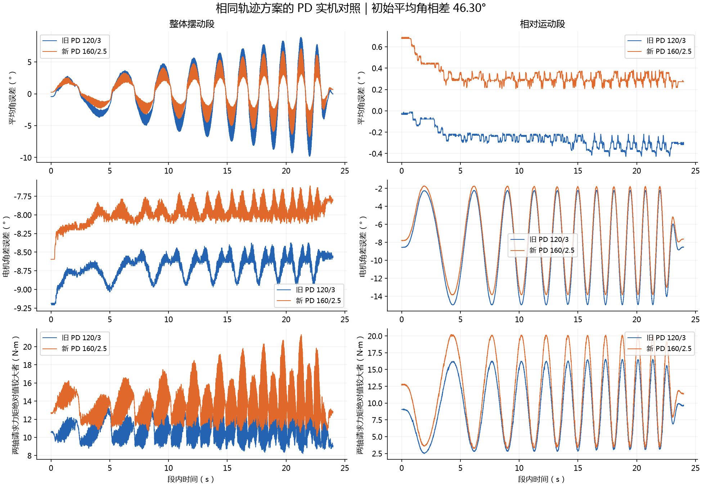

# 右腿 PD120/3 与160/2.5实测对照

当前采用160/2.5为右侧工程基线。它在本次记录中改善跟踪，但增加力矩与高频反馈量；初始平均姿态相差46.30°，热条件也不同，所以不是严格的单因素因果结论，更不代表物理模型已验收。

|指标|120/3|160/2.5|
|---|---:|---:|
|髋/膝位置RMSE rad|0.09048/0.08920|0.08058/0.07976|
|平均角误差RMSE rad|0.03964|0.02745|
|电机角差误差RMSE rad|0.16125|0.15065|
|髋/膝请求力矩RMS N·m|9.96/9.86|12.32/12.25|
|请求力矩峰值 N·m|24.39/25.83|29.88/30.19|
|40 N·m限幅比例|0/0|0/0|
|最高报告温度 °C|41/42|46/48|
|相对角实际跨度 rad|0.08164|0.11788|
|相对角参考跨度 rad|0.36|0.36|

相对角指两主动轴角差，不是机械内膝角。相对运动还有明显负载静差，不能说控制问题已全部解决。各段参考事件移除初态偏移后完全一致；没有把初态重力差伪装为相同加载条件。

新包2026-09-28 23:00:58 CST完成并自动失能，随后正常stop封包。677743条消息中，repetition0为975条准备/失败记录，没有执行段；repetition1为676768条，含5347准备、671420执行、1完成。第二次运行161段全部覆盖，无失败、无漏拍、无录包丢样，执行拍间隔最大1.544ms，未使能左腿。整包跨尝试的时间空洞不是执行过程丢拍；查看[按次QC](../../run_20260928T144606Z/repetition_quality.json)。

MCAP SHA256：`b7275ee9c56ee1632e6e624c606e1f7185dd8f6084ebf7904c49240fcd597b36`。本机原包、profile、消息定义、控制源码、库与运行日志已保留；机器人/本机哈希一致。用第二次运行进行real2sim开发拟合，第一次准备失败不得混入损失；整段留出和独立验证仍需分别验收。

[逐段数值](comparison.json) · [阶跃响应](step_response_comparison.png)。
