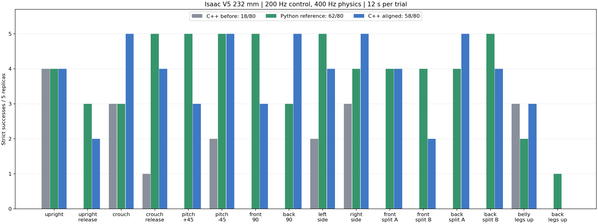

# 自起 C++ 对齐与 Isaac 闭环复测

更新：2026-10-03。分支 `dev/wheel_leg_rl`。

使用原 V5 232 mm、40–110°机械资产和相同 V5 ONNX。105°只是模拟 DM 编码器零位，不是V6止挡资产。
控制/反馈200 Hz、物理400 Hz、策略50 Hz；每例12 s，动作预算8 s，混合接管200 ms。

| 实现 | 末尾严格通过 | 曾连续稳定 RL ≥1 s |
| --- | ---: | ---: |
| 修改前 C++ | 18/80 | 26/80 |
| Python 原参考（10-03重跑） | 62/80 | 73/80 |
| 最终 C++ | 58/80 | 66/80 |

严格通过要求末尾连续1 s：100% RL输出、倾角<10°、高度305±20 mm、平面速度<0.2 m/s、角速度<0.5 rad/s、两轮接触力>2 N、非轮接触力<5 N，且无机构失效。评分真值不送入控制器。

| 姿态 | 修改前 C++ | Python | 最终 C++ |
| --- | ---: | ---: | ---: |
| upright | 4/5 | 4/5 | 4/5 |
| upright_release | 0/5 | 3/5 | 2/5 |
| crouched | 3/5 | 3/5 | 5/5 |
| crouched_release | 1/5 | 5/5 | 4/5 |
| pitch_forward_45 | 0/5 | 5/5 | 3/5 |
| pitch_backward_45 | 2/5 | 5/5 | 5/5 |
| front_down_90 | 0/5 | 5/5 | 3/5 |
| back_down_90 | 0/5 | 3/5 | 5/5 |
| left_side_90 | 2/5 | 5/5 | 4/5 |
| right_side_90 | 3/5 | 4/5 | 5/5 |
| front_down_left_forward_right_back_90 | 0/5 | 4/5 | 4/5 |
| front_down_left_back_right_forward_90 | 0/5 | 4/5 | 2/5 |
| back_down_left_forward_right_back_90 | 0/5 | 4/5 | 5/5 |
| back_down_left_back_right_forward_90 | 0/5 | 5/5 | 4/5 |
| prone_belly_legs_above | 3/5 | 2/5 | 3/5 |
| prone_back_legs_above | 0/5 | 1/5 | 0/5 |

最终失败分母：`{"terminal_stability_dwell": 8, "invalid_feedback": 6, "timeout": 8}`。
6次反馈失效均是主动轴角差超过 LUT 外的2 mrad容差，右侧超过表端点约2.31–9.51 mrad；保护未删除。8次超时主要是CAPTURE回弹，仰躺双腿朝上0/5，Python也只有1/5。另8次曾稳定RL满1 s，但末尾连续稳定时间不足1 s，未剔除。

修复了 IMU+髋/被动膝/轮轴合成制动、标定轴投影、气簧节点导数、条件高度选路、FOLD跟踪域、ORBIT/CAPTURE接触条件、着地判据、15 ms连续探测时钟、LUT节点选择及BLEND预算。新电流/发送时序验证、8°接管门槛、机械保护及实机禁用默认值保留。

同输入回放检查162827条有效记录，最大误差`{"conditional_height_m": 6.257168591594642e-08, "wheel_height_difference_m": 9.440940687555077e-08, "world_wheel_rate_rad_s": 2.3556166070193285e-05, "inner_knee_deg": 6.834293998281282e-06}`；此项检查数值运动学，不声称全部状态机位级一致。

`cpp_ticks.npz`保存200 Hz的29列输入和39列输出；`traces_000.npz`保存50 Hz评分和诊断。每次保留源码、SHA、profile、命令和TensorBoard事件。中断运行另存，不计入完成试验。

- `cpp_before`：[原始报告](/home/yukikaze/Documents/workspace/RMCS/docs/zh-cn/artifacts/self_righting_sim_20261002/cpp_matrix_16x5/report.json)。
- `python_reference`：[原始报告](/home/yukikaze/Documents/workspace/RMCS/docs/zh-cn/artifacts/self_righting_alignment_20261002/python_reference_matrix_16x5_20261003/report.json)。
- `cpp_aligned`：[原始报告](/home/yukikaze/Documents/workspace/RMCS/docs/zh-cn/artifacts/self_righting_alignment_20261002/cpp_aligned_final_matrix_16x5_20261003/report.json)。

复跑参数见同目录`*.command.json`。同输入检查入口：`.script/simulation/check_recovery_sensor_parity.py --training-repo <训练仓库> --run <C++运行目录>`。

尚未验证完整RMCS硬件图、CAN/USB/BMI088 EKF、实测热预算和V6止挡资产；此次未驱动实机。`recovery_enabled`和readiness仍为false。

Git 中保存报告、摘要、参数与图表；NPZ 原始轨迹、TensorBoard event、日志和重复源码快照保留在本机同目录，未随代码提交打包。
