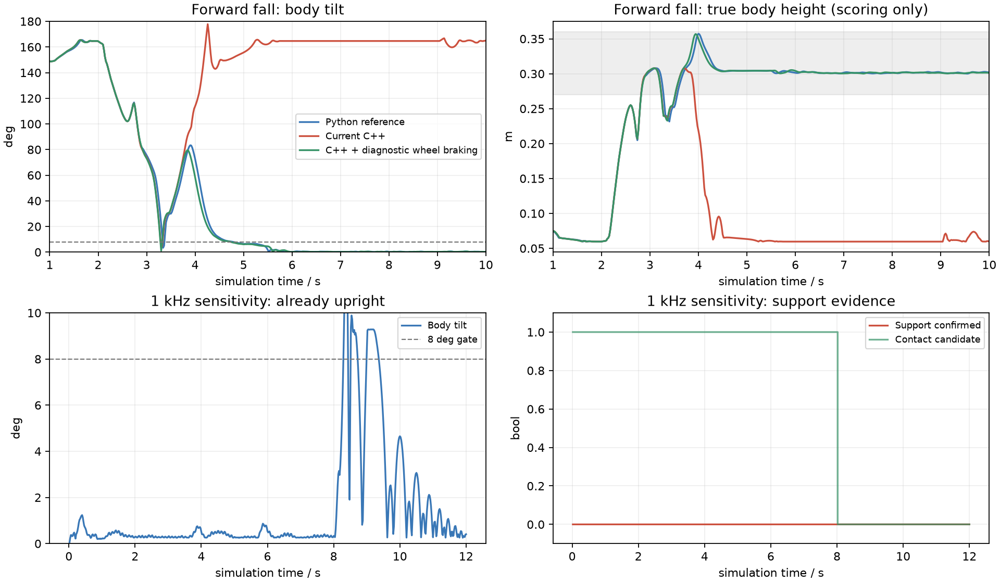

# RMCS C++ 自起的 Isaac 闭环复验（2026-10-02）

当前 C++ 自起控制器与支撑观察器尚未通过这轮完整回归。相同 16 姿态×5 个重复、12 s 观察窗口下，旧 Python 参考末尾严格通过 **62/80**，当前 C++ 为 **18/80**；曾连续稳定 RL 满 1 s 分别 **73/80、26/80**。

8° 是机体相对正立方向的总倾角，`acos(-g_z)`；不是膝角，也不是仅前后 pitch。旧脚本在 BLEND 之前已用腿 PD、轮平衡与制动力矩扶正，ONNX 在此前仅作影子计算。当前 C++ 有倒地回弹和支撑探测未确认两类失败，不能仅归因为 8° 太严。

## 成对矩阵

|姿态|Python 末尾严格通过|当前 C++ 末尾严格通过|C++ 曾稳定 RL|
|---|---:|---:|---:|
|`upright`|4/5|4/5|5/5|
|`upright_release`|3/5|0/5|0/5|
|`crouched`|3/5|3/5|5/5|
|`crouched_release`|5/5|1/5|2/5|
|`pitch_forward_45`|5/5|0/5|1/5|
|`pitch_backward_45`|5/5|2/5|2/5|
|`front_down_90`|5/5|0/5|0/5|
|`back_down_90`|3/5|0/5|0/5|
|`left_side_90`|5/5|2/5|4/5|
|`right_side_90`|4/5|3/5|4/5|
|`front_down_left_forward_right_back_90`|4/5|0/5|0/5|
|`front_down_left_back_right_forward_90`|4/5|0/5|0/5|
|`back_down_left_forward_right_back_90`|4/5|0/5|0/5|
|`back_down_left_back_right_forward_90`|5/5|0/5|0/5|
|`prone_belly_legs_above`|2/5|3/5|3/5|
|`prone_back_legs_above`|1/5|0/5|0/5|

## 差异定位

- 前后 90°倒地及四种劈叉在当前 C++ 完整矩阵中均 0/5。14 工况单次诊断中，当前前倒于约 3.10 s 进入 CAPTURE，随后回弹到倒置并耗尽 8 s 主动预算；同轮 Python 约 5.39 s 才开始 BLEND，当时实际倾角约 5.2°。
- M3508 的轮输出轴反馈速度已经可读（驱动内换算 15.8 减速比）。它是轮相对机构的转速，区别于旧脚本重建的轮整体角速度；后者叠加 IMU、髋、被动膝及轮自身转动。当前 observer 始终将 `world_wheel_omega_valid` 置 false，因此 THRUST／壳体接触时该项制动力矩为零。
- 仅在测试适配器中提供旧的传感器重建轮角速度，8°门槛不变，14 工况末尾通过由 6/14 变为 8/14。这支持轮制动缺失是一个因素；该诊断不是已接入部署的修复，也没有解决全部失败。
- 该制动诊断中三种劈叉已扶正到 8° 内，仍因支撑探测未确认而超时。例如一例在 7 s 时倾角约 2.2°、高度约 0.304 m，`contact_candidate=true`、`support_confirmed=false`。应审查探测脉冲、新反馈响应及采样噪声，不能把接触候选直接当成支撑确认。
- 控制／观测提高到 1 kHz、物理 2 kHz 的 14 工况敏感性测试为 0/14，均超时。其中已有正立工况仍无法通过支撑确认；该频率不是当前部署的 200 Hz PD 配置。
- 另有闭链 LUT 范围保护退出。测试保留了保护，没有靠删掉检查提高分数。CAD 滑块 q 的坐标原点可为负；适配器同时平移 q 与 s0，保持压缩量和导数不变，以匹配非负滑块标定接口。

## 条件与边界

Isaac Sim 6.0（本机包版本6.0.0.1）／CPU PhysX，200 Hz 反馈与控制、400 Hz 物理、50 Hz ONNX；合成 105°编码器零参考、IMU／编码器扰动、24 V 条件力矩包络（100 rpm、额定20 Nm、峰值40 Nm）、气簧与真实 PhysX 接触。该资产仍是 V5 232 mm、40–110°机械域，不能把105°编码器零参考称为V6止挡资产。
策略 SHA256：`ae58b862be5547195d8c4b3e71aa9be37b147792ebc903c68f032f341d92be6d`。资产 manifest SHA256：`dbec8e586cf29d9540db7040b133b3ff1170c1c700ff05eda64d94d8561c3dec`。

控制器只接收模拟 IMU、编码器及上一拍 PhysX 实际施加的轮力矩作为电流反馈代理；接触力、根高度与根速度只用于评分。仅 reset 写初态，其后不写根姿态翻正。模拟排队／电流响应是理想模型，没有验证 CAN／USB、BMI088 EKF、完整 RMCS Component 图或实测热预算。完整矩阵保留失败分母，严格通过要求观察窗口末尾仍连续满足站高、倾角、速度、双轮接触与机壳清离满1 s。
单次14工况与80环境矩阵的布局及扰动序列不同，只各自成对比较，不跨矩阵宣称配对成功率。
这轮未修改部署控制算法、未更换策略、未开启任何实机 readiness 或自起使能。

## 入口与证据

旧入口：训练仓库 `scripts/inspect_v5_activation.py`；动作实现 `ActivationBench.step`，传感器重建 `src/wheeled_tasks/chassis/recovery_observer.py`。
新入口：RMCS `.script/simulation/inspect_recovery_isaac.py`；它直接编译部署的 `recovery_controller.cpp`、`recovery_observer.cpp` 为测试桥，不另写一份 Python FSM。
每组 `*.command.json` 保留完整 argv，在训练仓库目录用记录的 Isaac Python 执行；C++ 文件快照、参数表、源码 SHA 在组目录，原始50 Hz轨迹在 `traces_000.npz`，C++ 门控反馈在 `cpp_feedback.npz`，TensorBoard event 只写文件，没有启动本机 TensorBoard 服务。
C++ 原始报告的列名／时钟元数据来自旧参考入口，已按 `cpp_metadata.json` 修正，修正前报告保留为 `report_before_metadata_repair.json`，物理轨迹与判分未改。可复跑入口现用父进程在 Kit 退出后完成报告元数据写入。

[汇总 JSON](./summary.json) · [完整 Python 报告](./python_matrix_16x5/report.json) · [完整 C++ 报告](./cpp_matrix_16x5/report.json) · [C++ 命令](./cpp_matrix_16x5.command.json)

Git 中保存报告、摘要、参数与图表；NPZ 原始轨迹、TensorBoard event、日志和重复源码快照保留在本机同目录，未随代码提交打包。
