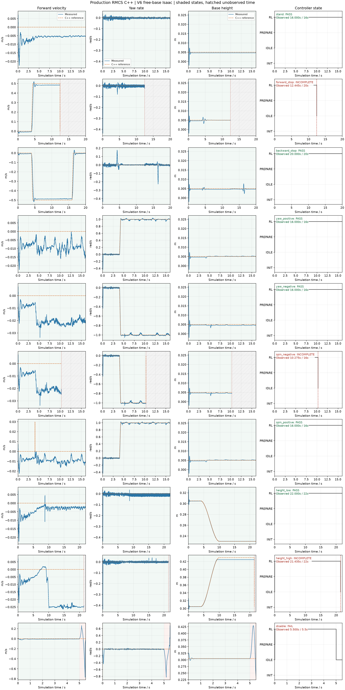

# V6 C++ dynamic simulation summary

Source run status: `complete`. Confirmed passes: 6/10.

| Case | Outcome | Observed / expected sim s | Wall s | Wall sample p95 ms | Last inference p95 us |
| --- | --- | ---: | ---: | ---: | ---: |
| stand | PASS | 16.000 / 16.000 | 25.065 | 9.167 | 83.625 |
| forward_stop | INCOMPLETE | 12.445 / 20.000 | 19.784 | 8.968 | 89.100 |
| backward_stop | PASS | 20.000 / 20.000 | 31.286 | 8.992 | 87.409 |
| yaw_positive | PASS | 16.000 / 16.000 | 25.039 | 9.178 | 86.509 |
| yaw_negative | PASS | 16.000 / 16.000 | 26.016 | 9.392 | 84.263 |
| spin_negative | INCOMPLETE | 10.275 / 16.000 | 16.129 | 8.924 | 87.821 |
| spin_positive | PASS | 16.000 / 16.000 | 25.060 | 9.211 | 87.679 |
| height_low | PASS | 22.000 / 22.000 | 34.326 | 8.939 | 87.383 |
| height_high | INCOMPLETE | 21.435 / 22.000 | 34.116 | 9.234 | 84.563 |
| disable | FAIL | 5.500 / 5.500 | 8.585 | 8.901 | 91.960 |

Inference and PD timings are cached last-call durations sampled in trace rows; their row counts are not invocation counts. Wall intervals use bridge values when saved, otherwise explicitly labeled estimates from wall_s differences.

Incomplete, missing, unknown-horizon and invalid cases cannot pass. The original report and case JSON are unchanged. This nominal simulation does not qualify hardware, CAN/USB or BMI088 EKF.

- `forward_stop`: controller_fault;
- `spin_negative`: controller_fault;
- `height_high`: controller_fault;
- `disable`: reported_checks_failed;
