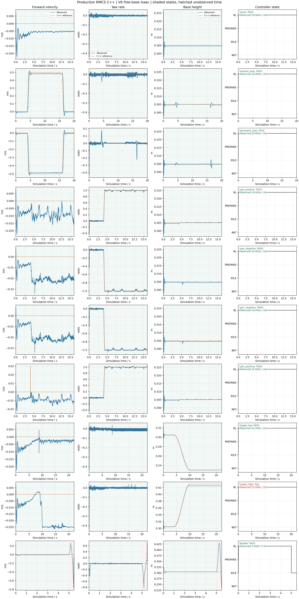

# V6 C++ dynamic simulation summary

Source run status: `complete`. Confirmed passes: 9/10.

| Case | Outcome | Observed / expected sim s | Wall s | Wall sample p95 ms | Last inference p95 us |
| --- | --- | ---: | ---: | ---: | ---: |
| stand | PASS | 16.000 / 16.000 | 25.364 | 9.239 | 87.457 |
| forward_stop | PASS | 20.000 / 20.000 | 31.755 | 9.289 | 86.175 |
| backward_stop | PASS | 20.000 / 20.000 | 31.726 | 9.081 | 88.341 |
| yaw_positive | PASS | 16.000 / 16.000 | 25.450 | 9.042 | 88.132 |
| yaw_negative | PASS | 16.000 / 16.000 | 26.580 | 9.672 | 86.943 |
| spin_negative | PASS | 16.000 / 16.000 | 26.049 | 9.446 | 89.171 |
| spin_positive | PASS | 16.000 / 16.000 | 25.475 | 9.141 | 90.457 |
| height_low | PASS | 22.000 / 22.000 | 35.091 | 9.181 | 87.407 |
| height_high | FAIL | 22.000 / 22.000 | 35.199 | 9.294 | 87.704 |
| disable | PASS | 5.500 / 5.500 | 8.771 | 9.454 | 86.890 |

Inference and PD timings are cached last-call durations sampled in trace rows; their row counts are not invocation counts. Wall intervals use bridge values when saved, otherwise explicitly labeled estimates from wall_s differences.

Incomplete, missing, unknown-horizon and invalid cases cannot pass. The original report and case JSON are unchanged. This nominal simulation does not qualify hardware, CAN/USB or BMI088 EKF.

- `height_high`: reported_checks_failed;
