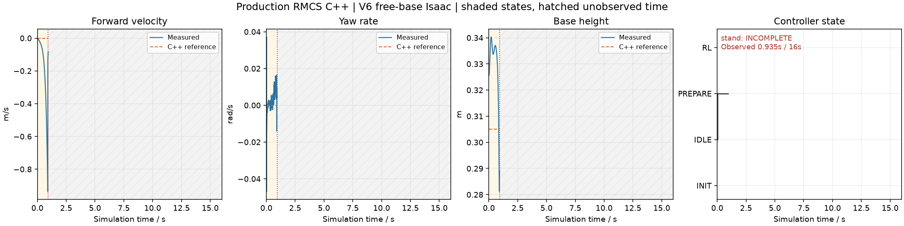

# V6 C++ dynamic simulation summary

Source run status: `complete`. Confirmed passes: 0/1.

| Case | Outcome | Observed / expected sim s | Wall s | Wall sample p95 ms | Last inference p95 us |
| --- | --- | ---: | ---: | ---: | ---: |
| stand | INCOMPLETE | 0.935 / 16.000 | 1.504 | 9.127 | n/a |

Inference and PD timings are cached last-call durations sampled in trace rows; their row counts are not invocation counts. Wall intervals use bridge values when saved, otherwise explicitly labeled estimates from wall_s differences.

Incomplete, missing, unknown-horizon and invalid cases cannot pass. The original report and case JSON are unchanged. This nominal simulation does not qualify hardware, CAN/USB or BMI088 EKF.

- `stand`: early_stop_or_short_run;
