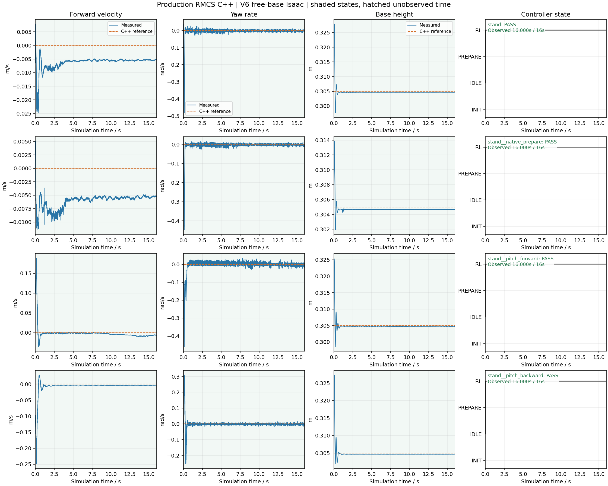

# V6 C++ dynamic simulation summary

Source run status: `complete`. Confirmed passes: 4/4.

| Case | Outcome | Observed / expected sim s | Wall s | Wall sample p95 ms | Last inference p95 us |
| --- | --- | ---: | ---: | ---: | ---: |
| stand | PASS | 16.000 / 16.000 | 25.255 | 9.095 | 86.377 |
| stand__native_prepare | PASS | 16.000 / 16.000 | 25.382 | 9.177 | 88.090 |
| stand__pitch_forward | PASS | 16.000 / 16.000 | 25.215 | 8.759 | 88.177 |
| stand__pitch_backward | PASS | 16.000 / 16.000 | 24.934 | 8.496 | 88.495 |

Inference and PD timings are cached last-call durations sampled in trace rows; their row counts are not invocation counts. Wall intervals use bridge values when saved, otherwise explicitly labeled estimates from wall_s differences.

Incomplete, missing, unknown-horizon and invalid cases cannot pass. The original report and case JSON are unchanged. This nominal simulation does not qualify hardware, CAN/USB or BMI088 EKF.
