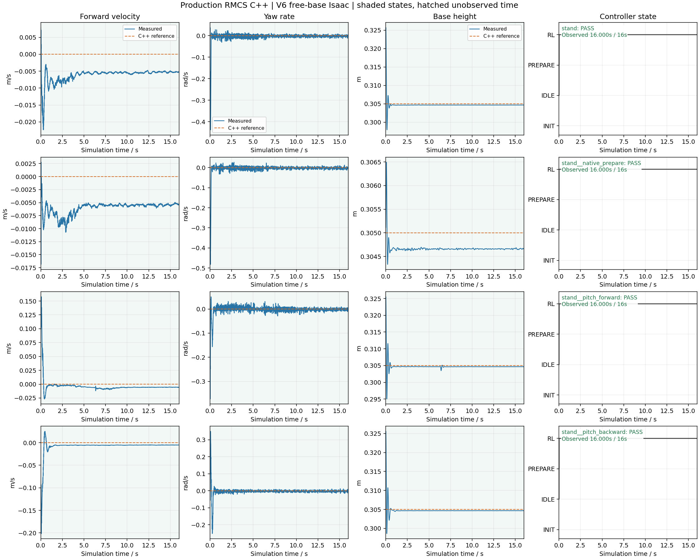

# V6 C++ dynamic simulation summary

Source run status: `complete`. Confirmed passes: 4/4.

| Case | Outcome | Observed / expected sim s | Wall s | Wall sample p95 ms | Last inference p95 us |
| --- | --- | ---: | ---: | ---: | ---: |
| stand | PASS | 16.000 / 16.000 | 25.358 | 9.014 | 86.596 |
| stand__native_prepare | PASS | 16.000 / 16.000 | 25.643 | 9.377 | 85.058 |
| stand__pitch_forward | PASS | 16.000 / 16.000 | 25.348 | 9.247 | 88.017 |
| stand__pitch_backward | PASS | 16.000 / 16.000 | 25.707 | 9.436 | 83.199 |

Inference and PD timings are cached last-call durations sampled in trace rows; their row counts are not invocation counts. Wall intervals use bridge values when saved, otherwise explicitly labeled estimates from wall_s differences.

Incomplete, missing, unknown-horizon and invalid cases cannot pass. The original report and case JSON are unchanged. This nominal simulation does not qualify hardware, CAN/USB or BMI088 EKF.
