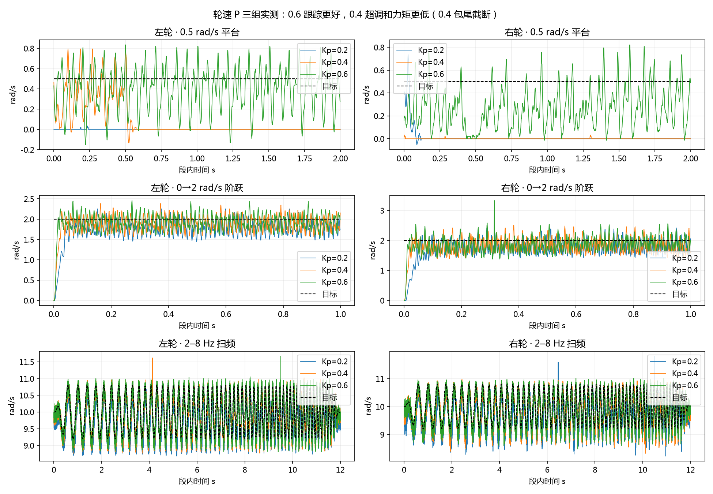

# 轮速三组参数判决

2026-09-28：**继续以 Kp=0.6、Ki=Kd=0、±4.5 N·m 作为轮侧控制基线。** 0.4 降低了瞬态超调与请求力矩，但跟踪和起转不及 0.6；0.2 的平台静差与动态误差最大。选择针对当前悬空数据，尚不是接地全工况最优或训练动力学发布。

|共同完整段统计，左 / 右|0.2|0.4|0.6|
|---|---:|---:|---:|
|单轮跟踪 RMSE，rad/s|0.5729 / 0.6276|0.3850 / 0.4170|**0.3461 / 0.3685**|
|多正弦 RMSE，rad/s|0.7786 / 0.8180|0.4641 / 0.4887|**0.3756 / 0.3957**|
|单轮请求力矩 RMS，N·m|0.1146 / 0.1255|0.1540 / 0.1668|0.1938 / 0.2075|
|阶跃超调 P95，10 样本均值诊断|8.46% / 11.63%|10.00% / 9.12%|17.25% / 17.03%|
|+0.5 rad/s 平台中位实速|0 / 0|0 / 0|0.424 / 0.278|

三组 ±0.2 rad/s 均基本不起转，0.6 的 ±0.5 仍有停走。后续应辨识静摩擦/反馈量化/驱动响应，不能把进一步提高 P 当成唯一解决办法。上表滤波只用于超调诊断；控制和原始峰值均未过滤。[完整统计](comparison.json) 保留原始全程口径和共有段口径。

0.4 控制器日志确认执行完 630 s 并归零电流，随后机器人重启，recorder 未正常封包。原始 MCAP SHA256 为 `db7de993216c164a0f26d87873ccfe854f07856bd842f4fb707d6fa85d7c035e`；已下载并核对哈希，只在副本上重建 metadata。可读 629742 条，其中执行 629592 条；包含全部 291 个段号，但最后零电流段少约 0.404 s、完成事件缺失，不能称为完整封存包。四次约 2 ms 调度间隔落在段 80/123/168/263；连续 tick 并不代表无漏调度。

三组统一剔除这四段及尾段 290，剩 **286 个完整段**；各保留段的目标保持事件序列一致。执行阶段 P 代数、限幅与原始 CAN0x200 电流编码均核对通过，无失败码或 recorder 主动丢样。0.4 峰值请求 4.145/4.219 N·m，未触及 4.5 上限。物理初始腿姿、温度和运行顺序未随机化，仍是工程比较。

0.4 可供整定和经窗口审计后的拟合开发，**不作为完整独立验收包**。0.6 冻结后另录保留轨迹/不同次序的验证包，完成接地基础测试；三次悬空数据均不能标定地面摩擦、满载力矩—转速或热降额。

