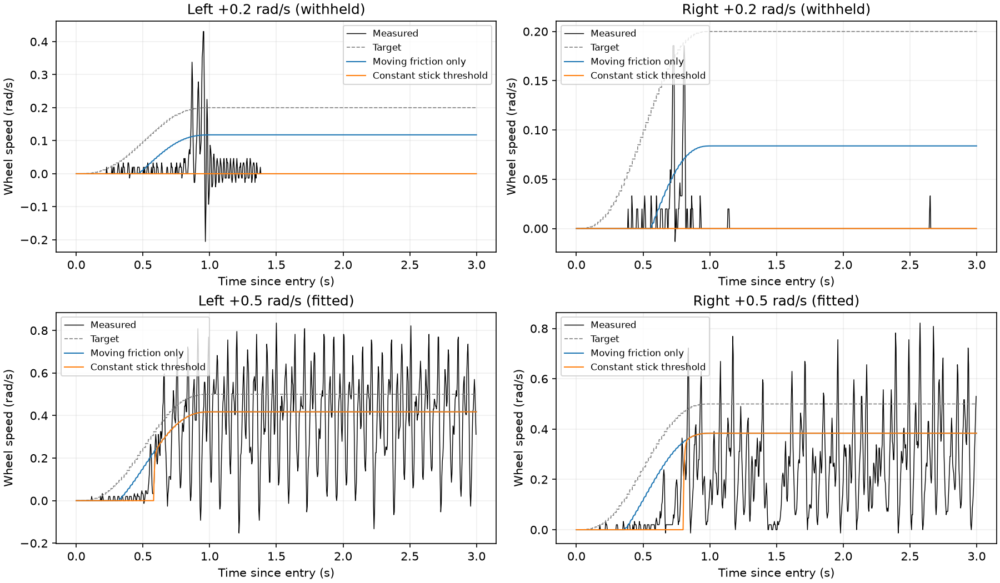

# 轮侧 real2sim：华南虎实现核查与三包离线辨识审查

2026-09-28。结论：保留已选 **P=0.6、I=D=0、4.5 N·m 命令上限**作为控制基线。现有数据足够拟合候选运动摩擦和有效惯量、检验模型反例，但还不能把全部轮侧物理参数作为已验收训练资产发布。新脚本只做 CPU 离线计算，没有修改硬件、控制器、网络或训练配置，没有启动 GPU 训练。

## 1. 作者原文、公开源码与缺失材料

作者[论坛原文 §4.2](https://bbs.robomaster.com/article/1942489?source=1)建议轮侧辨识静摩擦和黏滞阻尼；腿侧保留耦合机械，架起实车跟踪预设轨迹，录 bag，再用 MuJoCo 同轨迹回放调整参数。这是作者的方法说明，并不是已提供可运行的参数优化器。指定的 `/tmp/scut_identification_article_20260928.md` 只有文章标题与页面壳，本次使用同一会话此前提取的完整 `/tmp/v6_huananhu_forum_full.txt:71` 至 `:84`。

本地官方训练仓库 HEAD 为 `b8ff79f3df855faf9dc92f4a282bd80c42649466`，可核实的实现如下。类存在不等于所有环境都启用了该类。

| 实现 | 真正做什么 | 不能据此声称什么 |
|---|---|---|
| [`M3508Actuator.compute/_clip_effort/_load_torque_speed_curve`](https://github.com/scutrobotlab/wheeled-legged_RL/blob/b8ff79f3df855faf9dc92f4a282bd80c42649466/source/agent_world/agent_world/actuators/m3508_actuator.py#L28) | 基于 IdealPD 计算请求力矩，用 CSV 对称转速包络限幅；78–102 行把电机轴 CSV 转成轮输出轴 | 不是 bag 参数辨识器，也不是当前三包测得的物理摩擦模型 |
| 同文件 `_prepend_low_speed_extension`，118–150 行 | 在最低已知转速以下合成平滑延伸，受配置堵转力矩约束 | 合成低速包络不是实测静摩擦或起转阈值 |
| [`Wheelbipe_V14_M3508_CFG`](https://github.com/scutrobotlab/wheeled-legged_RL/blob/b8ff79f3df855faf9dc92f4a282bd80c42649466/source/agent_world/agent_world/assets/wheelbipe_V14.py#L253) | `damping=.2`、`stiffness=0`，速度反馈控制增益；减速比 `268/17`、力矩上限 5.5、armature .001 | `.2` 不是被动物理黏滞阻尼；5.5、.001 和其减速比不可直接搬到本机 |
| [`randomize_joint_parameters_v1`](https://github.com/scutrobotlab/wheeled-legged_RL/blob/b8ff79f3df855faf9dc92f4a282bd80c42649466/source/agent_tasks/agent_tasks/manager/mdp/isaaclab/events.py#L491) | 写入关节摩擦/黏滞/armature 等属性；585–639 行按仿真版本分支 | 不是估计器；版本小于 5 时该代码不设置 dynamic/viscous 项 |
| [`env_cfg.py:223`](https://github.com/scutrobotlab/wheeled-legged_RL/blob/b8ff79f3df855faf9dc92f4a282bd80c42649466/source/agent_tasks/agent_tasks/direct/wheelbipe/wheelbipe_V14/env_cfg.py#L223) | 启动时 wheel static `(0.05,.25)`、viscous `(0,.01)`，`operation="add"` | 随机化区间不是本机实测区间，也不能不核对仿真 API 的量纲便当作 N·m 写入 |
| [`LearnedVelocityActuator.compute`](https://github.com/scutrobotlab/wheeled-legged_RL/blob/b8ff79f3df855faf9dc92f4a282bd80c42649466/source/agent_world/agent_world/actuators/learned_velocity_actuator.py#L103) | 加载已有 TorchScript 与归一化数据，用速度目标、速度及 kd 历史预测力矩 | 当前文件不提供训练数据、bag 拟合流程或通用系统辨识保证 |

该快照没有找到所引用 `experiments/v14_flat/005_3508_motor/m3508_c620_current_closed_loop_raw_motor_shaft_curve_dense.csv`，也没有找到完整的 bag→MuJoCo 参数优化/验证脚本。因此可借鉴“分离控制器与物理模型、用同轨迹和留出轨迹比较”的原则，不能声称已复现作者未公开的优化过程。

## 2. 本机单位链：15.8 只转换一次

[`DjiMotor::configure`](/home/yukikaze/Documents/workspace/RMCS/rmcs_ws/src/rmcs_core/src/hardware/device/dji_motor.hpp:89) 已把反馈转成输出轴口径；[`wheel-leg.cpp:201`](/home/yukikaze/Documents/workspace/RMCS/rmcs_ws/src/rmcs_core/src/hardware/wheel-leg.cpp:201) 显式选择 15.8。

\[
\omega_{wheel}=s\,rpm_{motor}\frac{2\pi}{60\cdot15.8},\quad
\tau_{wheel,nom}=s\frac{i_{raw}}{16384}\,20\,(0.3\cdot187/3591)\,15.8.
\]

两个轮的当前 API 反向映射为 `s=-1`。NPZ 的 `dq_api[:,4:6]`、`tau_frame_api[:,4:6]`、`torque_fb_api[:,4:6]` 已是轮输出单位，不能再除/乘 15.8。电流力矩是名义 Kt 换算，不是负载传感器测得的轴扭矩。命令 4.5 N·m 量化后帧值可为 4.50007577 N·m，这是编码量化，不是新的软件限幅。

[`extract_wheel_speed_bag.py:45`](/home/yukikaze/Documents/workspace/RMCS/.script/identification/extract_wheel_speed_bag.py:45) 分别核对 `P*(target-speed)`、4.5 限幅以及 CAN 电流字节。三包记录的是 P=.2/.6/.4，不是三种物理阻尼。`P=.6` 的单位与黏滞系数同为 N·m/(rad/s)，但前者乘**速度误差**，后者乘**真实轮速**，二者不可混用。

本次还逐行重新解码反馈原帧，绝大多数值与上述一次转换精确相符；少量行的原帧与标量字段不一致：.6 包左/右速度各 24/17 行、反馈力矩各 45/50 行，分母均 630000。三包详细计数见 [原帧检查](raw_feedback_unit_check.json) 与 [主结果](offline_fit_audit.json) provenance。它说明存在少量帧/标量对齐不确定性；不能仅据此认定线程或驱动根因，更不能以第二次减速比转换“修正”。新拟合排除了速度原帧不一致的完整 50 ms 窗。

## 3. 旧拟合已经得到什么，尚未得到什么

旧脚本 [`fit_wheel_speed_bag.py:99`](/home/yukikaze/Documents/workspace/RMCS/.script/identification/fit_wheel_speed_bag.py:99) 取平台末 .8 秒，排除近静止、速度不稳、腿动和反馈过旧窗口。三包每轮最终都只有六个 ±10/20/30 rad/s 平台点参与运动阻力拟合。其模型是方向相关的运动库仑项与线性黏滞项：

\[
\tau_{res}=C_+\mathbf1_{\omega>0}-C_-\mathbf1_{\omega<0}+b\omega.
\]

这不是起转静摩擦 `F_s` 的测量。方向截距还混有未分离的电流零偏/传动方向非对称。六个台阶足以代数拟合三个参数，但不意味着对未知工况稳健。右轮 .6 包删除一个速度正负对后，b 可从近零变化到 .000316；同包用反馈电流代替命令电流，原 b 又从 .0001129 变成 .000324。物理参数仍对采样和信号来源敏感。

起转反例已在现有数据中出现，无须推测：

- .6 包 ±.2 rad/s 平台末段，名义命令约 ±.11992 N·m，左右轮几乎静止，位置范围仅 0–.0000971 rad。
- .4 包 +.5 rad/s 平台末段，约 +.20007 N·m，左轮位置范围 0，右轮约 .0000971 rad，速度几乎为零。
- 当前运动库仑项约 .05–.07 N·m，若直接令 `F_s=C`，模型会预测上述末段轮应转动，违背观测。这是指定末段的停住/再粘住证据，不代表该段从未起转，也不是已经精确标定全工况 `F_s=.2`。完整起转过程的补查见 §6。

旧惯量拟合固定前述阻力，用 ±5/±20 滑行段拟合 J，以同包 ±10 滑行段检查。这是**同一包内的整段留出**，不是一场独立新实验。惯量是轮、减速器反射惯量及未消除机械耦合共同形成的有效值，不能直接作为额外 armature 加到已有 CAD 惯量上。

## 4. 本次实际执行的离线改进与反证

独立脚本 [audit_fits.py](audit_fits.py) 使用 .6 包，固定控制器，不再差分估算噪声较大的加速度，而拟合 50 ms 非重叠积分窗：

\[
\int\tau_{frame}\,dt
=J\Delta\omega+C_+\int\mathbf1_{\omega>0}dt-C_-\int\mathbf1_{\omega<0}dt+b\int\omega dt.
\]

训练仅用单轮、非 validation、**非 coast** 段；要求整窗 |ω|≥1、不反转、时间连续、反馈年龄≤5 ms、腿部安静、原帧速度一致。左/右保留 2764/2732 窗，归一化设计矩阵条件数约 3.2。所有滑行段与计划标记的 multisine 留出，不参与新积分模型拟合。参数如下，均是名义轮输出力矩基准的候选值：

| 轮 | J kg·m² | C+ N·m | C− N·m | b N·m/(rad/s) |
|---|---:|---:|---:|---:|
| 左 | .004442 | .04929 | .04972 | .0006085 |
| 右 | .004393 | .06967 | .06948 | .0003429 |

没有为匹配验证曲线再优化 P、延迟、Kt 或静摩擦。比较基线是已有 .6 包平台+滑行模型，且其 ±5/20 滑行已用于拟合，故两者对全部滑行的拆分并不相同。下表均为按段等权的平均 RMSE，完整逐段结果保留在 JSON，不能把平均值当成每段都通过。

| .6 包回放，rad/s，左 / 右 | 原平台+滑行模型 | 新积分候选 |
|---|---:|---:|
| 全部 6 个滑行段 | .509 / .616 | .281 / .685 |
| 留出多正弦，直接回放记录力矩 | 2.552 / 2.980 | 1.475 / 1.472 |
| 同一留出多正弦，重建固定 P=.6 闭环 | .166 / .201 | .167 / .202 |

新候选改善了左轮滑行与部分力矩回放，但右轮滑行变差，12 秒开环力矩回放仍有明显累计误差，不能宣称辨识已完成。新候选在 .6 包左 +5、右 −5 滑行的相对 RMSE 分别为 10.83%/16.36%，右 −10 为 10.29%，没有通过旧脚本采用的逐段 10% 口径。闭环模型使用记录的目标保持序列、已知 P/限幅及自身预测速度，尚未建模实际反馈量化、延迟、C620 电流响应或低速静摩擦。

这也构成具体反证：**两个不同的动力学模型在固定 P 闭环中的曲线几乎同样接近实车，开环力矩回放却明显不同。只验闭环曲线相似，容易让控制器反馈掩盖模型误差。** 这不否定 real2sim；它要求 real2sim 同时检查平台、起转、零电流滑行与留出响应。

跨运行回查亦已执行：冻结 .6 包新候选后，.2/.4 包滑行平均 RMSE 左为 .299/.271，右为 .690/.527 rad/s；两包留出多正弦的开环力矩回放仍可达 1–2.45 rad/s。它们是已有不同 P 的独立录制运行、同一轨迹族的回溯检查，不是新采盲测。.4 包尾部缺少完成事件、存在调度间隙，本次只用连续合格窗口，不能提升为完整封存验收包。运行次序、温度与腿姿未随机化。

脚本已执行合成已知参数恢复、正负滑行单调性、训练集合不含 coast/validation 的检查。输出含三份 NPZ SHA。局部积分拟合矩阵可辨识，不等于绝对物理尺度可辨识：若真实力矩为 `α*τ_nominal`，同时缩放 α、J、C、b 会保持速度响应不变；缺少独立力矩或惯量基准时，这些仍是名义尺度下的有效参数。

## 5. 训练接入边界与下一次验证

1. 控制层独立冻结 `P=.6`、`I=D=0`、真实更新频率与4.5限幅，记录为控制合同。当前训练 [`V5Control.motor_efforts:45`](/home/yukikaze/Documents/workspace/robot_rl/isaac_wheeled_rl_train/src/wheeled_tasks/chassis/v5_control.py:45) 的 `wheel_prior["kd"]*(target-dq)` 正是速度 P；将来接入 .6 应改这里对应的控制合同，而不是把拟合 b 填进去。
2. 物理层分开保存 `F_s±`、运动 `C±`、`b`、有效惯量的来源与不确定性。候选 C/b/J 现在只进入离线审查产物，`F_s` 标记“未完成”。必须在固定轮输出坐标映射下实现阻力；若走引擎属性，先以单轴恒力矩/滑行检查 API 单位、符号和版本，不能把 SCUT 的随机化数字直接当作本机 N·m。
3. 避免重复阻尼与重复惯量。当前 [`env.py:178`](/home/yukikaze/Documents/workspace/robot_rl/isaac_wheeled_rl_train/src/wheeled_tasks/chassis/env.py:178) 的监测分支主动轮 IdealPD damping=0，由上层明确发力矩。新增阻力必须清点资产内关节阻尼/摩擦和执行器内反馈；`J_eff` 先减去模型已有投影惯量及已建模贡献，再讨论附加 armature，负差值应触发审查而非静默归零。
4. 轮序必须按关节名绑定：bag 六轴轮在索引 4/5，训练 `V5Control` 六轴轮在 2/5。schema 标注 `wheel_output`、rad/s、N·m、15.8 已应用、Kt 名义值、运行标识、参数/控制合同版本，防止位置索引和比值重复转换。
5. 下一次独立验证应保持 P=.6，冻结候选后再录制新包：换留出频率/顺序，覆盖两方向从静止慢升/降的起转—再粘住过程、多个速度的零电流滑行、恒速平台和短阶跃。明确静摩擦段与运动摩擦段分开评价，并保留温度、初始腿姿和帧/标量一致性检查。这里只有方案，未执行新实验。
6. 发布前同时通过名义电流/力矩回放与控制闭环回放；若残差随方向、低速、温度或频率系统变化，先增加对应可测模型项，再限定随机化范围。当前悬空数据不能辨识轮胎地面摩擦、满载力矩—转速包络或热降额，不能借 SCUT CSV 或默认5.5上限填补这些缺项。

复现：在有 NumPy/SciPy 的 CPU Python 环境执行本目录 `audit_fits.py`。它只读取已提取数组与存档轨迹计划，输出本目录 JSON，不重读硬件、不启动 ROS、MuJoCo 或 Isaac。

## 6. 补查完整起转过程：有效阈值范围与常数 stick 模型

新增 [audit_breakaway.py](audit_breakaway.py)、[逐段结果](breakaway_audit.json) 和 [反例图](breakaway_counterexamples.png)。仍只用现有 .6 包；没有新增录包或硬件操作。

完整数据修正了仅看平台末段容易产生的印象：+0.2 rad/s 入口阶段左/右轮曾短暂滑动，位置范围约 .02146/.00898 rad，随后才粘住。右轮一处满足“前50ms近静止、随后20ms有持续位移”的事件，名义命令转矩约 .097 N·m；后来末段约 .120 N·m 却又近静止。其他低速入口存在先缓慢微动、再明显滑动的过程，严格的静止前置窗口往往不成立。

因此不能简单取“所有静止样本的最大转矩”作为统一 Fs 下界，再取“第一次检测到速度的瞬时转矩”作为统一 Fs 上界：速度起动会立即通过 P 回路减小命令，且电流响应/反馈时间不同，存在预滑移和历史差异。宽松预滑移窗口中，左负向同一次 −.5 段两次事件的转矩范围约 .058–.069 与 .194–.206 N·m；右正向 +.5 段可见约 .242–.247 N·m 的事件，稍后又在约 .30 N·m 附近停走。这些是局部观测转矩带，不能组合成严格、唯一的物理阈值区间。JSON 保留了窗口定义及命令/反馈两种口径，未把微动窗口冒称完全静止。

做了最小双区模型试验：固定 §4 的 J、C±、b 和 P=.6，静止时若 |τ|≤Fs 保持粘住，超过阈值后使用运动库仑+黏滞动力学；过零时可重新粘住。只用 ±.5/±1 rad/s 的入口+平台选择 Fs±，不改变控制增益。网格搜索结果如下：

| 轮/方向 | 最低拟合损失的有效 Fs，N·m | 损失≤最低值1.05倍的网格范围，N·m |
|---|---:|---:|
| 左正 | .185 | [.049, .250] |
| 左负 | .215 | [.115, .255] |
| 右正 | .280 | [.196, .299] |
| 右负 | .186 | [.069, .233] |

**该范围是固定简化模型下的目标函数平坦区，不是统计置信区间、实测硬界或推荐训练随机化范围。** 起转事件与整体速度 RMSE给出的偏好不同，说明最优 Fs 也在补偿尚未建模的响应，不能直接当作真实静摩擦常数。

| ±.2 同包留出，速度 RMSE rad/s | 仅运动摩擦 | 加常数 Fs |
|---|---:|---:|
| 左 +.2 | .1037 | .0463 |
| 左 −.2 | .1022 | .0034 |
| 右 +.2 | .0722 | .0193 |
| 右 −.2 | .0728 | .0021 |

±.2 段既未进入原 J/C/b 拟合，也未进入 Fs 搜索，可称**整模型的同包留出**，仍不是新实验。加入 Fs 修正了末段应静止的行为，但模型预测整段不动，漏掉正向实测短暂滑动；不能只根据 RMSE降低便验收。±.5 段的持续大幅停走也未复现，常数 Fs 主要改变第一次起动时刻。

第二组 `step_1` 对 Fs 搜索留出，但此前 J/C/b 拟合已使用该组，**不是整模型留出**。其左右 RMSE仍为 .2586/.2759 rad/s，两个模型数值一致，因为阶跃请求远高于候选阈值，不能有效区分这些 Fs 候选。这也是应优先用低速缓升、再粘住与滑行验证摩擦，而不是只看大阶跃的具体证据。

当前能支持的机制判断是：必须区分运动阻力与静止/预滑移行为；单一常数阈值虽有帮助，仍解释不了全部历史。位置相关阻力、预滑移弹性、传动间隙、驱动电流动态及反馈估计是待区分的候选机制，现有分析未将其中某项认定为唯一根因。下一步即使继续只用旧包，也应先比较实际电流响应与原始角度位移的一致性，再决定是否增加有明确参数含义的状态项，避免通过更复杂摩擦模型吸收时序或控制器误差。

补充脚本已验证低于阈值保持静止、正负方向超过阈值可运动，以及 ±.2 未进入任何一层拟合集；图已检查。所有新 Fs 仍停留在本离线研究目录，未写入训练参数。
