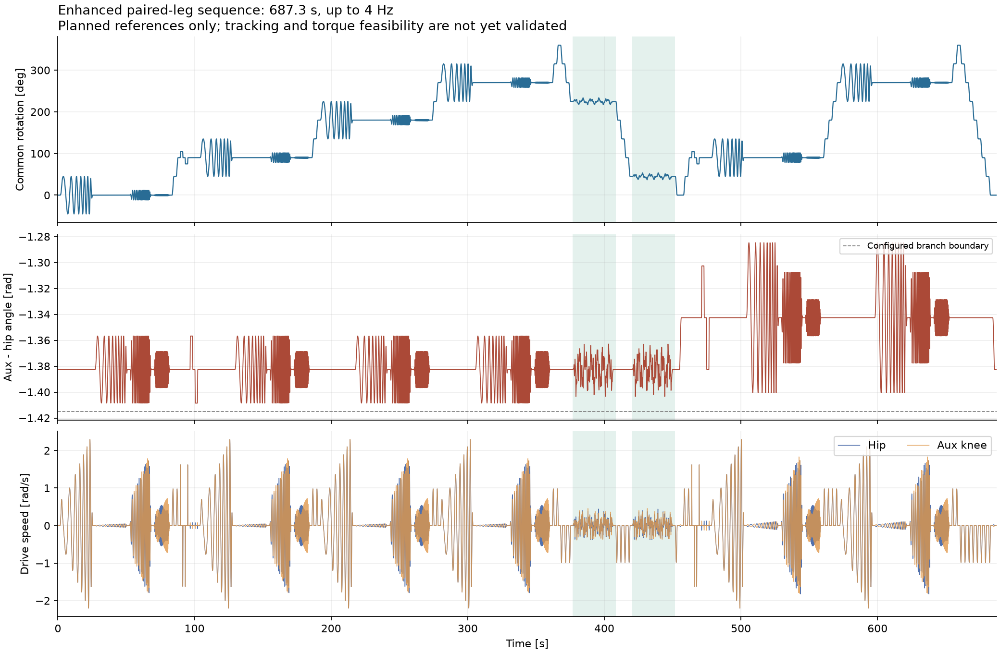
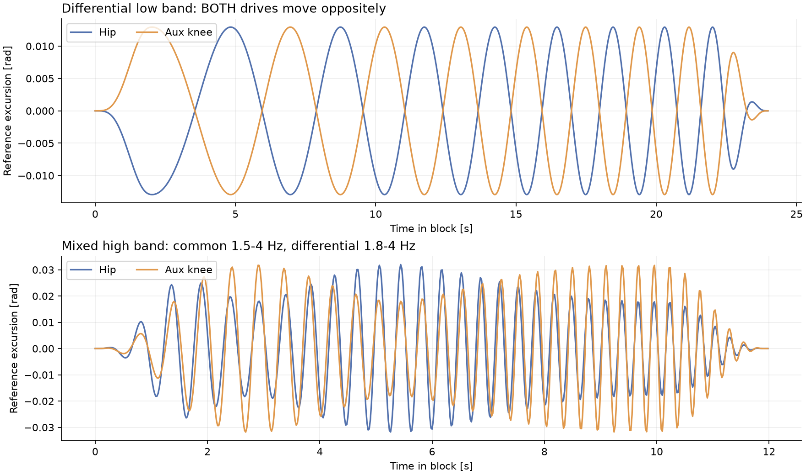
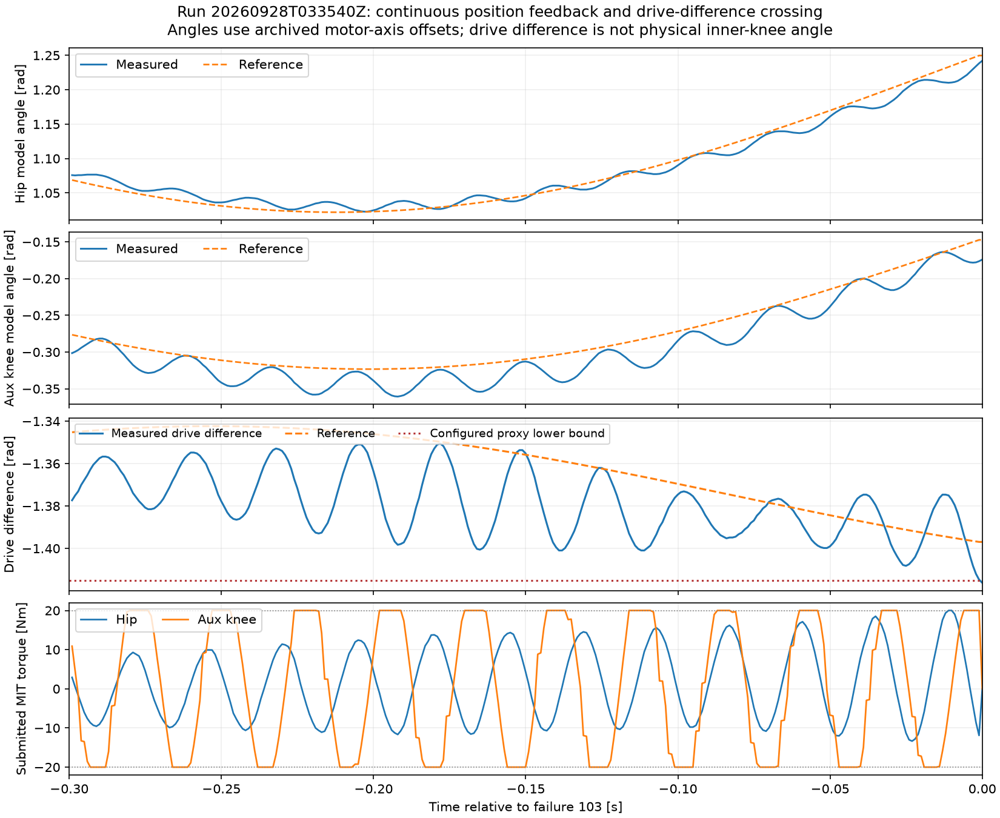

# 双电机联合增强扫频 v2：固定车体、保留气簧和重力

> 2026-09-28晚更新：本文保留早期实验历史。旧start-multiband/record-multiband入口已归档；当前使用start-pd-loaded/record-pd-loaded，见[代码清理说明](wheel_leg_identification_cleanup_20260928.md)与[PD现状](artifacts/pair_multiband_v2/real2sim_20260928/README.md)。
本方案接续左腿 251.4 s 实测。用户要求更复杂、更广覆盖，并明确可以更加剧烈。实现为独立 `wheel-leg-infantry-pair-multiband-identification.yaml`，模式 `multiband_chirp`，保留旧版配置文件；启动时将选定图同时设为远端普通重启的默认配置。单侧 687.3 s（11 分 27.3 秒），153 个段；先左腿，再右腿，最后双侧复核另行配置。增强版早期曾因调度间隔和未标定驱动角差阈值中止；04:01 UTC 准备的连续观测版现已完成左腿全部 153 段并封包，实际跟踪质量和物理参数另行验收，详见末节。

## 实测依据与本次修改

旧 bag 的相对角扫频段，辅助膝有 72.2% 时间触及 20 Nm；0.4 rad 的参考跨度只产生约 0.159 rad 实际跨度，而且主要是漂移，没有持续往复。关键问题在扫频之前已经出现：为了容纳大幅值，旧规划器将起始驱动角差约 -1.383 rad 推到 -0.935 rad，这个参考锚点并未在 20 Nm 内到达。

新计划的腿型 A **直接采用启动时实测角差**，不预先强推到几何区间中心。腿型 B 仅向区间内部移动至多 0.04 rad；它仍是候选参考，不能假定实机已经到达。幅度由起始几何余量收缩，不能为了满足请求幅值反过来移动锚点。这里没有在线学习或自动加大力矩；新 bag 用于判断实际覆盖。

|项目|上一版|增强版|
|---|---|---|
|单侧时长|251.4 s|687.3 s|
|动态实验姿态|主扫频集中在同一朝向|A 腿型 0/90/180/270°，B 腿型 90/270°，共六组|
|重力网格|90° 一点，两腿型|45° 一点，两腿型，每轮整圈正转后沿原路返回|
|共模扫频|0.05–0.5 Hz、±45°|三段至 4 Hz，低频 ±45°、中频 ±0.2 rad、高频 ±0.025 rad|
|相对角扫频|髋保持，辅助膝承担相对位移|髋、辅助膝等量反向运动；单独差模及联合激励|
|阶跃|0.8 s 上升|0.30 s 上升，正负两向，髋膝联合|
|整圈网格移动|90° / 4 s|45° / 1.5 s；比本轮最初设计的 45° / 3 s 加倍|
|验证激励|反向联合扫频|两个 30 s、不同频率线的多正弦段，单独标记为验证|
|参考最大加速度|约 9.27 rad/s²|约 16.79 rad/s²|
|主动力矩上限与控制频率|20 Nm、1 kHz|20 Nm、1 kHz|

## 两轴坐标与机械事实

定义 `c=(q_hip+q_aux)/2`，`d=q_aux-q_hip`，则：

```text
q_hip = c - d/2
q_aux = c + d/2
```

- 共模：两电机同向同量旋转，保持驱动角差，改变机构相对重力的朝向。
- 差模：两电机反向各承担一半角差变化，平均驱动角保持不变；髋并非被停用。
- 联合：共模和差模使用不同扫频律，差模再错开 π/2 相位，两个输入不是同一波形的简单复制。

`d` 是两驱动轴角差，**不是物理内膝角**；没有实测几何映射前不声称覆盖了多少度内膝关节。反向分担参考也不保证静态所需扭矩减少。仿真继续固定车体，保留连杆/轮组质量、闭链、重力与气簧，关闭轮地接触，复现本次串级、积分与饱和。

## 每组姿态中的激励

|段|时长|共模频率 / 幅值上限|差模频率 / 幅值上限|
|---|---:|---|---|
|单独共模低频|24 s|0.08→0.5 Hz / ±0.7854 rad（45°）|固定 d|
|单独差模低频|24 s|固定 c|0.1→0.65 Hz / ±0.060 rad|
|联合中频|16 s|0.5→1.5 Hz / ±0.200 rad|0.65→1.8 Hz / ±0.035 rad|
|联合高频|12 s|1.5→4 Hz / ±0.025 rad|1.8→4 Hz / ±0.014 rad|

每段后停留 1.5 s。扫频首尾各 2 s 用五次窗渐入/渐出，位置、速度、加速度连续；频率程序上限为 4 Hz，尾部幅值渐退，因此实际有效带宽必须根据 bag 的输入能量和响应确认。

所有差模幅值按下面的实际规划值执行：

```text
A_applied = min(A_requested, 0.8 * min(d_anchor - d_low, d_high - d_anchor))
```

以已录起始角差 -1.3826436 rad、左分支有效边界 [-1.415, 0.155] 为例，A 腿型低频差模实际为 ±0.025885 rad，B 腿型为 ±0.057885 rad。不能将表中 ±0.060 rad 当作每次一定实现的幅度，更不能将参考幅度当作实测幅度。每个新段的日志显示名称、时长、参考/实际角差和低频差模幅度上限；1 kHz bag 保存真正下发的参考、反馈和力矩。

两腿型的 90° 位置还分别执行共模 ±15°、差模至多 ±0.04 rad 的正负阶跃，每次上升/返回各 0.30 s、停留各 1.5 s。阶跃是有限上升时间的五次曲线，不是瞬时位置跳变。

## 整体执行顺序和验证隔离

1. 在启动实测姿态保持 1.5 s，腿型 A 的 0° 位置执行四段频带实验。
2. A 腿型每 45° 转动并停留，在 90/180/270° 各做一组实验；90° 加阶跃；到 360° 后原路返回。
3. A 腿型回程 225°、45° 各做 30 s 多正弦验证，加 1.5 s 衰减尾段。这些动态激励不参与拟合；两处此前的静态网格数据可用于负载拟合，因此不是“从未见过的姿态”。
4. 平滑切换到候选腿型 B，重复整圈正反向网格，只在 90/270° 做频带实验；90° 再做阶跃。
5. 平滑回到初始参考，停留 1.5 s，完成后自动撤销使能。

验证共模频率线为 `[0.17, 0.43, 0.79, 1.31, 2.17, 3.73] Hz`，幅值为 `[0.08, 0.04, 0.025, 0.012, 0.005, 0.003] rad`；差模频率线为 `[0.23, 0.61, 1.07, 1.73, 2.41, 3.91] Hz`，幅值为 `[0.015, 0.012, 0.008, 0.005, 0.003, 0.002] rad`。差模各分量按总幅度 0.045 rad 统一应用几何余量缩放。固定相位与频率保存在生产规划器及每次启动的源码归档中。

`segment_waveform=8` 表示多正弦，`segment_role=1` 表示验证，包括其尾段。新增的只是 waveform 取值说明，没有改变 ROS 消息字段布局。原局部常惯量/仿射负载拟合器拒绝此模式，需要固定基座非线性闭链回放拟合。





以上图片是生产规划器生成的参考，不是仿真跟踪结果，也不是实测曲线。

采集后的参数辨识采用[华南虎同参考 real2sim 方法及本项目函数设计](wheel_leg_real2sim_scut_method_20260928.md)：固定车体保留完整闭链与气簧，复现本次 1 kHz 串级，用两轴仿真/实测响应残差拟合并以独立多正弦验证。该文区分已核查的上游执行器函数、拟新增的自动拟合目标与当前实现边界。

气簧沿用既有静态拟合曲线，不作为本轮电机辨识自由参数。执行顺序为控制环稳定性与诊断录包、固定气簧的电机/传动响应辨识、冻结参数后正式录包验证、最后接入训练及域随机化。控制调试阶段也保留 bag；不要求等物理参数已经知道才开始记录，亦不把持续振荡的完整扫频直接作为验收通过。

## 启动与录包

在开发容器 `/workspaces/RMCS` 中，构建并同步完成后，实车拨双下：

```bash
.script/identification/remote-wheel-leg-identify start-multiband
```

脚本核对本地/远端配置与控制库，切换到独立新图，启动新 rosbag 并检查真实订阅。看到 `Recorder subscribed and active` 后双中。与旧版不同，完整轨迹预检约需 5.4 s 的调度预算，之后才开始 687.3 s 序列；新配置 `ready_timeout_s=12`，启动自检拒绝不够覆盖预检的预算。

完成后双下并封包：

```bash
.script/identification/remote-wheel-leg-identify stop
```

新包使用 `left-pair-multiband-时间` 前缀；右腿需同时改控制器和记录器为 `side: right`，单独建包。若新图已经由其他入口运行，`record-multiband` 可挂录包而不重启。普通 `start`、`record` 仍对应旧版配置，不能混用。当前连续观测配置显式设置 `probe_measured_delta_policy: diagnostic`：预检通过后，实测驱动角差越过软件区间只告警，按原参考继续采集；该区间不是直接测量的大小腿夹角或气簧行程。启动姿态与参考仍检查该区间，双下、反馈失效、电机故障和非有限数据仍撤销使能，20 Nm 上限不变。其他配置缺省使用 `stop`。

## 验证和本轮验收

生产规划器对左右两侧、区间内及近边界的多种起始角差逐 1 ms 检查，参考最大速度约 2.2958 rad/s、最大加速度约 16.7939 rad/s²，分别低于 4 rad/s、20 rad/s² 指令预算。单元测试检查解析导数、所有衔接、差模反向配合、六组姿态覆盖、独立验证输入、真实控制器物化配置/预检/双下撤销使能。相关 C++ 测试 65 项通过，配置与拟合 Python 测试 23 项通过。

这不证明 20 Nm 能跟踪所有参考。下一包逐段报告实际角差的往复量、饱和占比、位置误差、实际频带响应及温度。持续顶力矩、只有单向漂移的段保留为饱和/负载数据，不冒充正常动态覆盖；拟合只按实际输入与输出评估，不因整段执行完成就宣布参数有效。本次没有产生辨识参数或更新训练随机化。

机器可读产物：[1 ms 参考审计](artifacts/pair_multiband_v2/reference_audit.json)、[153 段清单](artifacts/pair_multiband_v2/segments.json)、[50 Hz 参考预览](artifacts/pair_multiband_v2/reference_50hz.csv)。清单按上一轮起始姿态举例；实际新包的初始姿态、配置哈希、控制源码归档和逐拍参考才是回放依据。


## 02:27 录包的配置回退与修复

`left-pair-multiband-20260928T022710Z` 启动录包之后，后来的 executor PID 2048 加载了 `wheel-leg-infantry-pair-identification.yaml`。实测运行参数为 `rotation_chirp`，日志确认执行的是 251.4 s 旧序列，随后正常撤销使能。该包已封存，共 253,467 条样本；目录中的 `profile.yaml` 原本记录增强版，不能将它视为实际生效的合同。

保留原始包及归档文件，另写入 `RUN_INVALID.json` 和事后观察到的旧配置副本。带此标记的包会被导出 CLI 和完整性检查拒绝，避免误用于增强版拟合；低层只读分析仍可用于故障排查。

根因是专用启动入口显式选择增强版，但 `/root/env_setup.bash`、`/root/env_setup.zsh` 中普通重启的默认值仍为旧图。现在 `start` 类操作在完成双下检查后调用已有 `set-robot`，让默认启动与选定实验一致。录包就绪握手还通过控制器参数服务核对实际 `probe_pattern`、`control_frequency_hz`、`side`、`max_tick_gap_s`，与归档不符则不宣布就绪。该检查发生在启动时，并非运行期间持续监控任意外部进程替换。

用户重新构建同步后，当时在新鲜双下、四个关节报告失能的状态下准备了进程 PID 2435，命令行确认为增强版配置。其包为 `/root/identification_bags/left-pair-multiband-20260928T024030Z/bag`；握手保存了实际 `multiband_chirp / 1000 Hz / left`，随后执行结果见下节。

新增验证：启动握手使用实际嵌入的 Python 代码分别注入错误模式、错误频率、错误侧别，均拒绝写入就绪文件；正确合同通过。隔离标记阻止导出及完整性验收。相关导出/检查测试 21 项通过、1 项跳过，启动合同测试 4 项通过。

## 02:40 实测的计时停机与修复

以上时间戳后缀为 UTC。`left-pair-multiband-20260928T024030Z` 已封包，119,765 条消息、154.8 MiB，记录器报告丢样为 0。序列运行 114.305 s 后，在段 29 `shape0/out/pose90/common_low` 报 `Identification stopped (2): Executor tick or steady clock discontinuity`，主动撤销使能；没有跑完 687.3 s。

原始样本 `control_steady_ns` 显示相邻两次实际采样间隔为 **13.449913 ms**，更新计数仍只增加 1。执行器日志随后增加 12 个 skipped 周期，最大启动迟到 12.519 ms。控制器读的是执行器计划时间，记录器另存实际单调时钟，因此停机样本比实际长间隔晚一个更新出现。这是主机调度停顿的证据，不能拿来推断 USB 传输延迟；尚未定位导致调度停顿的具体系统任务。

旧控制器外层配置上限为 10 ms，串级内部另有写死的 12 ms 上限，单独放宽 YAML 会在内层再次失败。本次修改：

- 增强扫频两层统一使用 `max_tick_gap_s=0.020`；配置检查、运行时握手也核对该值。旧扫频配置保持 10 ms。
- 增强扫频遇到超过 2.5 个标称周期、但未超过 20 ms 的间隔时，保留当前积分值，该次不积分，参考按当前执行器时间更新一次；不补算缺失周期。下一正常周期恢复积分。
- 超过 20 ms、计数不连续、时钟不前进仍会终止。双下和反馈失效仍优先处理，20 Nm 上限、几何分支、轨迹与控制增益保持原值。
- 日志增加前后 tick、实际检查的间隔和上限；每轮第一次可接受的长间隔会说明积分处理。

通过 `.script/build-rmcs` 构建。相关 C++ 测试现为 69 项，包含 13 ms 继续、20/21 ms 边界、积分保留与恢复、双下/反馈失效优先和时钟回退；配置与启动握手 Python 测试 21 项通过。参考审计随新配置哈希更新，轨迹仍为 687.3 s。

该包实际运行配置可信，保留为**未完成实验**，不作错误配置包隔离。它尚未到达独立多正弦验证段，不能据此验收辨识参数。初始静止段无饱和，但首组共模低频辅助膝触及力矩上限占 38.65%，联合高频占 35.58%；计时修复不等于已解决这些跟踪/振荡问题。后续拟合应使用实际时间、实际下发力矩和反馈，明确排除或单独处理停顿邻域，不能按均匀 1 ms 假定补齐。

原始诊断：[计时失败与逐段摘要](artifacts/pair_multiband_v2/run_20260928T024030Z/timing_failure_summary.json)。

## 修复后的准备状态（03:07 UTC）

已同步并在新鲜双下状态下替换为 executor PID 2938，命令行及普通重启默认值均为增强版配置。远端控制库 SHA-256 为 `720de3ff3fb180ae6de5da582761f0d6a0aec5c2513429a5e1af64754926ec9f`，配置为 `9c0f876165206619c240c3955b8430b3eb23a79ea0c7ea073e6c820c85295afe`，均与本次构建一致。

新 bag：`/root/identification_bags/left-pair-multiband-20260928T030723Z/bag`。已确认发布者唯一、记录器订阅且未暂停，实际参数为 `multiband_chirp / 1000 Hz / left / max_tick_gap_s=0.02`；[就绪握手](artifacts/pair_multiband_v2/run_20260928T030723Z/recording-ready.json)已保存。准备后状态服务确认双下、左右使能请求均为 0、四电机均失能且无故障。该记录只证明启动准备成功，完整执行结果待实测。

随后归档下载时 SSH 连接中断，重试报告 `No route to host`。本地就绪 JSON 根据中断前成功读取的远端文件内容保存，哈希也已通过中断前的双端读取确认；未声称断连后的实时状态或完整执行成功。重连后应先检查当前进程与录包，避免重复启动覆盖正在进行的实验。

## 03:35 UTC 重新挂接预设轨迹采集

用户确认先用预设轨迹联合驱动再辨识。重连发现 executor 已于 03:29 UTC 重新启动（PID 57），当前配置/控制库哈希与上述修复版一致，但没有 rosbag 进程。03:07 包只留下 0 字节 MCAP，未取得可读样本，不能用于拟合。

本次通过 `record-multiband` 给现有程序挂接新 bag，不重启、不改轨迹/增益。新目录为 `/root/identification_bags/left-pair-multiband-20260928T033540Z/bag`，启动脚本已确认订阅就绪。初次检查 DR16 无有效信号、四电机失能，等待操作者开启遥控器、双下复位后双中启动。固定气簧拟合曲线进行后续离线辨识；是否完成采集与参数验收另以实际 bag 为准。

用户随后确认双下；状态服务也确认 `dr16 fresh=1`、开关 `[2,2]`、使能请求 `[0,0]`、四电机状态 0 且无故障。录包实际合同为 `multiband_chirp / left / 1000 Hz / max_tick_gap_s=0.02`。已允许操作者拨双中启动预设序列；就绪回执及当时状态存于 `artifacts/pair_multiband_v2/run_20260928T033540Z/`。此条不代表序列已完成。

## 03:35 包的驱动角差停机与连续观测修订

该包已封存：69,570 条样本、69.568935074 s、89.9 MiB。预检后实际序列运行 64.098 s，在首组联合中频段停止，代码 103。完整副本已取回 `/home/yukikaze/Downloads/identification_bags/left-pair-multiband-20260928T033540Z/`。

左腿被检查的量为 `delta = q_aux_model - q_hip_model = q_aux_api - q_hip_api - 1.33`，不是物理内膝夹角。最后测得 `-1.416213474 rad`，软件下界 `-1.42 + 0.005 = -1.415 rad`，越线约 `0.001213474 rad`（0.070°）。这只能说明驱动坐标越过预设区间，不能证明触及真实机械限位。

两轴整包原始位置每拍最大变化均为 18 码（0.006866560 rad），停机邻域连续变化、反馈序号逐次增加，未见孤立位置大跳变。最大实际采样间隔 1.431328 ms；这次与先前 13.45 ms 调度停顿不同。编码器与速度反馈是否存在相位差仍需后续时序对比，不能凭位置连续就宣布全部传感链路无误。

首组共模低频髋/辅助膝饱和比例为 16.40%/21.55%，联合中频已录片段为 9.33%/31.58%；跟踪误差与响应振荡需要保留分析。当前没有据此自动加大增益、力矩或参考幅度。

应操作者“持续驱动观测”的要求，新增显式 `probe_measured_delta_policy`：默认 `stop`，仅 probe 可选 `diagnostic`。增强扫频选择后者，只有进入运行阶段才将该未标定角差阈值改为一次性诊断告警；原始反馈和参考逐拍进入 bag。初始姿态与预设参考约束、有限值、数值轴范围、遥控器/电机反馈与故障处理仍生效。日志明确区分驱动角差与实际膝角。录包握手增加该参数核验，避免文件已改而旧进程仍按原策略运行。

通过 `.script/build-rmcs` 构建，四组相关 C++ 测试全部通过；新增检查包括越过角差阈值后继续、双下退出、初态不放行、反馈失效仍退出、严格模式仍停机及数值轴范围/有限值保留。配置和实际启动握手 Python 测试 23 项通过；左右分支的 1 ms 参考审计通过，轨迹仍为 687.3 s。构建/测试通过不代表新观测运行已经完成。

原始诊断：[编码器、停止邻域与分段摘要](artifacts/pair_multiband_v2/run_20260928T033540Z/encoder_stop_summary.json)。



该图用本包原始样本和归档偏置绘制，连续位置变化上叠加小幅快速振荡，辅助膝力矩多次触及正负上限。对最后 0.3 s 位置残差去线性趋势、加 Hann 窗后，10–100 Hz 内的峰值频点约为髋 40.0 Hz、辅助膝 36.7 Hz；短窗频率分辨率约 3.33 Hz，只能提示约 35–40 Hz 的响应成分，不能将其直接等同于已经辨识出的 FOC 极点或认定具体成因。

## 连续观测版准备（04:01 UTC）

构建与相关测试完成（74 项 C++、23 项配置/启动握手 Python 测试通过），确认新鲜双下、四关节失能后，通过 `start-multiband` 加载 executor PID 752 并启动 `/root/identification_bags/left-pair-multiband-20260928T040116Z/bag`。双端核对控制库 SHA-256 为 `c99e5297fa5e98ad32b61e19a1d500dce378fd0174bca6a5398e1b14c75bf9fe`，配置为 `ce3d6b25467dcbc8feaacfe808af01d0e27a9b1ffd41b7a6202e0e95bdc362f1`。录包握手确认 `multiband_chirp / left / 1000 Hz / max_tick_gap_s=0.02 / probe_measured_delta_policy=diagnostic`，发布者唯一且记录器订阅、未暂停。源码、配置和二进制随本包归档。

[就绪记录](artifacts/pair_multiband_v2/run_20260928T040116Z/recording-ready.json)与[准备时实机状态](artifacts/pair_multiband_v2/run_20260928T040116Z/prepared-state.txt)已保存。准备成功与序列完成分别记账，实际运行结果待采集。

## 04:01 包完整执行与封存

操作者双中后，于 04:03:23 UTC 开始准备，约 5.471 s 后执行 687.3 s 预设轨迹，04:14:56 UTC 日志报告 `Identification PROBE complete; disabling drive`。运行日志包含 0–152 全部 153 个段，未出现 `Identification stopped`。曾记录 `drive_delta=-1.415069 rad` 越过软件下界，诊断模式继续执行。运行结束后状态服务确认使能请求 `[0,0]`、四 DM 状态为 0 且无故障。

已停止记录器、写完 MCAP 和 metadata：692,773 条消息，记录器时间跨度 692.771979759 s，895.4 MiB。远端原件 `/root/identification_bags/left-pair-multiband-20260928T040116Z/bag`；完整本机副本 `/home/yukikaze/Downloads/identification_bags/left-pair-multiband-20260928T040116Z/`。MCAP 双端 SHA-256 均为 `a052c14e7070c7ad6171cc64bc6fe9c993d1c7521a20ff00a5018bae656d1232`。源码、控制库、配置、消息定义、运行日志和录包就绪回执随包保存。

在线观察订阅曾漏收部分消息，其统计不能替代 bag 完整性结论。本机使用[流式观察统计脚本](artifacts/pair_multiband_v2/summarize_recording.py)读取封存 MCAP；该脚本先在 03:35 旧包上复核，样本数、失败码、原始码变化及最大采样间隔与先前分析一致。它只做数据和响应统计，不代表 MuJoCo 参数辨识通过。

整包[统计结果](artifacts/pair_multiband_v2/run_20260928T040116Z/recording_summary.json)：

- `phase=1/2/3` 分别为 5,471 / 687,301 / 1 条，末态 3，失败码为空；153 个段齐全，独立验证及尾段共 63,000 条。
- 记录器累计丢样 0、tick 缺口 0；最大实际采样间隔 1.215474 ms。运行期所选轴反馈时间超前样本 0，最大反馈年龄约 1.718 ms；未选侧启用样本 0。
- 髋/辅助膝相邻拍最大位置变化 0.006485 / 0.011063 rad，原始编码器分别 17 / 29 码，未见整圈角度跳变。此结论不等于已校准编码器全部动态误差。
- 驱动角差范围约 [-1.416595, -1.316267] rad；最小值仅越过原软件下界约 0.0914°。它仍不是物理内膝角范围。
- 髋/辅助膝指令力矩峰值均为 20 Nm，MIT 量化后帧值约 20.0044 Nm。运行期饱和比例分别 2.085% / 30.245%；两个 30 s 独立多正弦段的辅助膝饱和比例约 42.64% / 42.60%。辅助膝仍有振荡和明显饱和，不能把完整执行当成跟踪或物理参数验收。
- 两轴报告温度分别为 30–31°C / 33–39°C。

该包保留为可信配置、完整采集的响应记录，用于固定气簧曲线、完整闭链和实际串级下的 real2sim 对比。饱和段按真实已裁剪输入处理；当前仍未产生或冻结电机辨识参数，未向训练写入新的参数。
