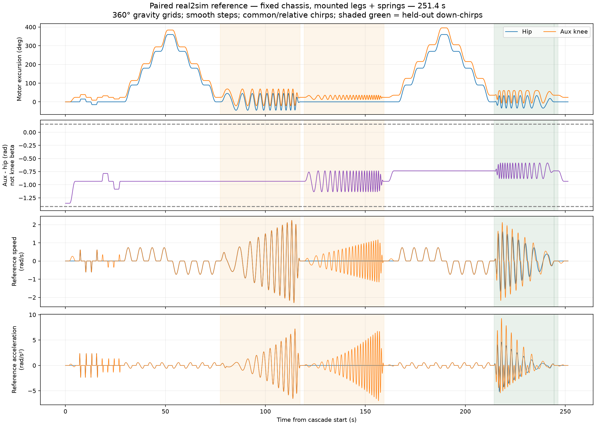
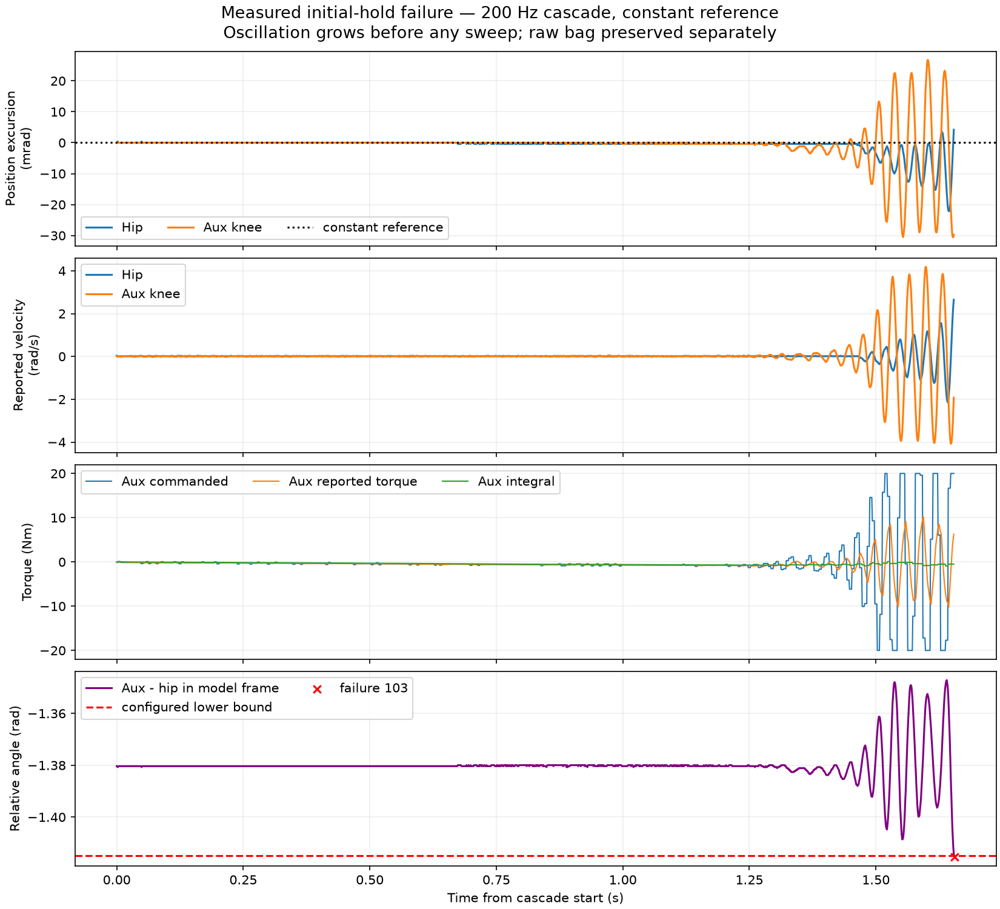
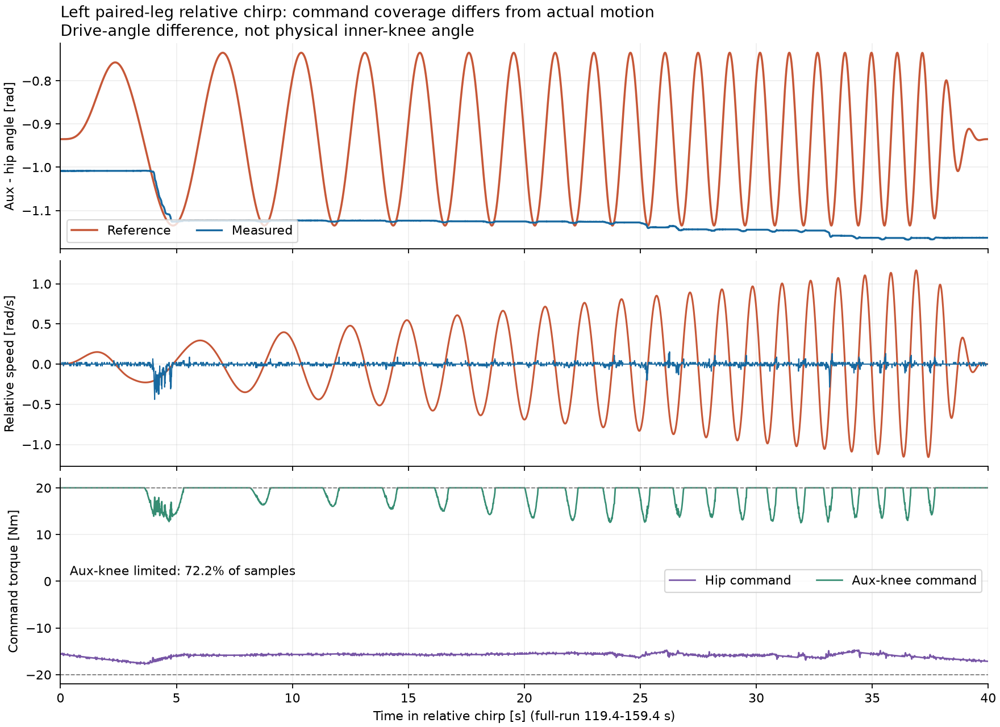

# 架空整腿辨识：整圈重力采样与连续扫频 v1

当前默认：`experiment_stage: probe`、`probe_pattern: rotation_chirp`。左腿先做，右腿另起一个 bag；双侧复核留在两侧单独拟合之后。本次没有改网络结构或启动 RL 训练。

车体由刚性支架固定，腿、连杆、气弹簧、轮组保持实物装配并悬空。髋与辅助膝电机始终由同一个控制器成对控制。共模坐标 u 对两电机加同一转角，相对坐标 v 只改变两电机角差：

```
q_hip = q_anchor_hip + u
q_aux = q_anchor_aux + u + v
```

辅助电机角差不是物理内膝角 beta。本轮不使用虚构的 beta 查表。大腿可以整圈转动，参考和反馈跨 ±π 连续解缠；全程不重置 DM 编码器零位。

## 本轮动作表

以下时间从 1 kHz 串级开始算，之前还有约 2 秒逐点轨迹预检和使能准备。动作总长 **251.4 秒（4 分 11.4 秒）**。

|时间 / s|动作|用于辨识|
|---|---|---|
|0–7|当前姿态停留 2 s，3 s 平滑进入相对角内部，再停留 2 s|初始负载、进入可双向激励的腿型|
|7–29.4|共模 ±15°、相对角 ±0.15 rad，各做去回阶跃；每段上升 0.8 s，停留 2 s|响应延迟、静摩擦、跟踪误差、串级积分|
|29.4–77.4|腿型 A：0→90→180→270→360→270→180→90→0°；每次转动 4 s、停留 2 s|整圈重力变化、正反方向滞回；髋/膝同步转动|
|77.4–117.4|共模连续线性扫频 ±45°，0.05→0.5 Hz|带完整机构负载的整体动态响应|
|117.4–119.4|停留|响应衰减|
|119.4–159.4|相对角连续线性扫频 ±0.2 rad，0.1→1 Hz；髋保持位置但仍主动出力|并联耦合、相对运动摩擦、弹簧响应|
|159.4–166.4|停留，平滑切换腿型 B（相对角向区间中心再变 0.2 rad），再停留|改变弹簧/机构几何|
|166.4–214.4|腿型 B：重复整圈正反向重力网格|比较两种腿型的朝向相关负载|
|214.4–244.4|两个坐标同时反向扫频：共模 ±33.75°，0.5→0.05 Hz；相对角 ±0.15 rad，1→0.1 Hz，相位错开|独立动态验证段；不参与参数拟合|
|244.4–251.4|验证末端停留 2 s，平滑回腿型 A，停留 2 s 后失能|完整尾部数据和恢复|

扫频头尾各 3 秒用五次窗渐入/渐出，中间保持完整幅值。位置、速度、加速度连续。`segment_waveform=6` 为扫频，`7` 为整圈网格；验证由 `segment_role=1` 单独标记。

相对角锚点从本次实际姿态计算，留出两种腿型与激励幅度所需空间，不把左侧目标硬抄给右侧。以当前左腿约 `[1.02932,-0.32395] rad` 模型角为例，腿型 A 的角差为 -0.935 rad、B 为 -0.735 rad；这些是**参考**，并不保证实机已到达。



生产 C++ 规划器按 1 ms 采样得到：参考最大速度约 2.295 rad/s，最大加速度约 9.273 rad/s²。配置的 4 rad/s / 20 rad/s² 是指令预算，不是已辨识的电机能力。保留用户指定的 ±20 N·m 主动扭矩上限。实际饱和、达不到目标、速度/加速度估计超阈值都记录下来；不能用目标曲线代替实际激励覆盖。

历史制动能力 0.4 rad/s² 没有辨识依据，不再用于否决本轮参考轨迹；实测速度/制动/跟踪估计保持诊断。实际机构角差越界、反馈失效、电机故障仍会失能；双下始终优先失能。

## 重力和固定车体如何接入 real2sim

**架空并不等于无重力。** 支架承担车体负载与反力，连杆和轮组的重力矩仍作用在两驱动轴，气弹簧也仍有力。仿真固定车体的六自由度，保留整套机构质量、质心、惯量、轮组、闭链约束和气弹簧。关闭轮地接触；不能将整车质量错误地作为站立支撑负载，也不能把所有连杆重力设为零。

固定基座模型应比较 `M(q) qdd + C(q,dq) + g(q,g_body) + tau_spring(q) + tau_friction(q,dq,...)` 与驱动作用，模型里保留双电机耦合。重力方向使用支架上的真实车体姿态；bag 包含 IMU 四元数和加速度，可用静止段核对其外参、轴向和加速度计比力符号，再将世界重力转换到车体系。不能默认支架上的车体恰好水平。

整圈同腿型停留使重力项随朝向变化；改变相对角后重复，可观察弹簧/机构几何造成的负载变化；正反方向接近同一姿态保留摩擦/滞回信息。这些数据增加可辨识性，但停留力矩不是“纯重力”，也不能仅凭它唯一分离气簧预载、静摩擦和驱动偏置。

本轮 `gravity_feedforward_model` 保持 0，表示**没有猜测前馈**，不是禁用真实重力。PC 速度 PI 自行承担保持负载，bag 同时记录积分项、反馈估计力矩、限幅前/后力矩与下发量化帧。MuJoCo 闭环轨迹回放需要复现本次 1 kHz 位置→速度 PI 和 1 kHz 力矩更新、积分/抗饱和、实际延迟与反馈采样；另可用已记录下发力矩进行短窗动力学验证。

旧 `fit_wheel_leg_pair_bag.py` 是局部常惯量/仿射负载模型，不能跨整圈解释重力周期性；对 `rotation_chirp` 明确报错，避免给训练输出错误参数。导出与原始 bag 保留，后续在**固定基座非线性闭链仿真**中拟合，使用反向联合扫频验证后，再把参数及不确定性接入训练随机化。本次尚未实现该非线性参数优化器，也没有生成辨识参数。

## 录包和复现

开发容器 `/workspaces/RMCS`：

```bash
# 双下；完成 build / sync / wait-sync 后
.script/identification/remote-wheel-leg-identify start
# 等打印 Recorder subscribed and active，然后双中执行
# 动作完成或要停止时双下，再封包
.script/identification/remote-wheel-leg-identify stop
```

普通 `rmcs-cli r` 只启动控制器，不等于启动 rosbag。辨识请用上面的专用入口。启动脚本校验本地/远端配置和控制库哈希，并确认真实 rosbag2 订阅及 `is_paused=false`，成功后才提示双中。握手失败退出，不宣称录制已准备好。该检查是启动时握手，不是磁盘写入全过程的持续健康监控。

远端每次独立保存至 `/root/identification_bags/left-pair-时间/` 或 `right-pair-时间/`：

- `bag/`：MCAP，`/wheel_leg/identification/sample`；在双中及终止边界发布样本。双中之前录制进程已就绪。
- `profile.yaml`、SHA256、`.msg/.idl`、控制库哈希及控制库副本。
- `controller-source.tar.gz`：本次工作树的控制器、规划器、驱动源文件，含未提交内容；另存仓库 HEAD，不能把 HEAD 单独当作本次源码版本。
- `recording-ready.json`、`recorder.log`、`status-before-launch.txt`、ROS 环境版本。

采样载荷包括六轴原始位置/速度/反馈估计力矩，双轴参考与串级误差、积分、限幅标记，实际提交给板卡的 CAN 字节及主机提交时间、反馈序号和接收时间、电机状态/温度、IMU、段号和训练/验证标记。未知母线电压仍为 NaN；DM 力矩来自驱动估计，不是独立力传感器；提交时间不等于电机执行时间。1 kHz 记录也不表示每个电机都有 1 kHz 新反馈，后续按各轴反馈序号去重及对齐。

右腿实验必须同时更改控制器和记录器的 `side: right`，重新同步、启动新 bag；不沿用左腿 bag 路径。最后的双侧复核需另行配置，当前图只驱动一侧两电机。

## 本次验证与状态

- 左右分支整条规划轨迹按 1 ms 检查，完整一圈和反转中两电机的共模角差保持不变。
- 检查跨 ±π 的连续角、分段端点、位置/速度导数、扫频周期变化，以及真实控制器物化新模式后的预检和双下撤销使能。
- 相关 C++ 测试 58 项通过；配置/拟合 Python 测试 18 项通过（拟合测试在有 SciPy 的主机上运行；开发容器缺 SciPy）。
- 独立 ROS domain 下用真实 Jazzy rosbag2 验证了订阅/未暂停握手并封存 161 条合成样本；这些是软件验证数据，非实机辨识。
- 截至同步时，新序列尚未在电机上运行。需新鲜 DR16 双下后切换进程并启动本轮录包。

参考审计：[reference_audit.json](artifacts/pair_rotation_chirp_v1/reference_audit.json)。20 Hz 预览 CSV 只用于查看参考，不替代 MCAP 原始数据。


## 初始保持 103 停机复核与 1 kHz 修正

实机 bag：`/root/identification_bags/left-pair-20260928T011836Z/bag`。共 4185 条样本，含一次用户重启；分析只选最后一次启动的 1655 条运行样本（1.654 s）。段号始终为 0，两个参考完全不变；此前没有执行阶跃或扫频。该 bag 用于故障诊断，不能当作完整辨识通过的数据。

停止前膝反馈速度达 -4.077 / +4.187 rad/s，髋膝主动指令均触及 ±20 Nm，膝振荡主频约 31 Hz、髋约 37 Hz。末帧角差 -1.4154505 rad 越过当前配置下界 -1.415 rad；因此是 103 几何停止，而非加速度诊断停止。启动初期还可见速度量化零点附近的偏置和积分缓慢增长，暂不据此改写原始测量或任意补重力。



最新上游 `feat/rmcs_rl` 已取到 `e29c3dad910ff39f230ccf6086f7900bfcb2ef7e`，仅 fetch，没有切换用户工作树。与前次参考 `fdb5573a` 相比，相关 YAML 的改动只是注释，硬件映射未改。

|轴|上游与本地发送/接收总线|发送 ID / master ID|模型零偏|
|---|---|---|---|
|LH|CAN1|1 / 1|-1.6|
|LK|CAN2|1 / 1|-2.93|
|RH|CAN1|2 / 2|+1.6|
|RK|CAN2|2 / 2|+2.93|

四轴均 reversed。上游直接给出 `wrap(offset - raw)`；本地硬件给出 `-raw`，控制器再加同一 offset 并连续解缠；速度和力矩映射也一致。硬件配置数组 D=[LH,RH,LK,RK] 与控制/记录数组 P4=[LH,LK,RH,RK] 已逐处核对，未发现直接混用。MIT P/V/T 为 12.5/45/54，p_des/v_des/Kp/Kd 为零，扭矩打包方向一致。

bag 中命令与对应驱动反馈力矩的相关性：髋→髋约 0.896，膝→膝约 0.929（对应最大正相关滞后约 8 / 7 ms），显著强于交叉对应；反馈位置导数与其速度同号且尺度接近。这支持软件通道没有串轴，不能单独证明物理接线/机械命名永远正确；这里的滞后也不是纯 USB 通信延迟，而含驱动响应和闭环动态。

找到的确定实现差异：上游在 1000 Hz 执行速度 PI，旧辨识串级却每 5 拍更新一次、其余拍保持力矩。Ki 的秒制换算没有消除这个延迟差异。现恢复每个 executor tick 都执行串级，配置和记录器均显式写 `control_frequency_hz: 1000.0`，静态检查拒绝缺字段或不一致，启动日志明确打印 `no 5-tick torque hold`。位置/速度增益、20 Nm 上限、编码映射和大幅轨迹不变，以便下一次实测对照。上游还具有速度指令斜坡，本轮轨迹自身平滑但反馈校正未完全复刻该斜坡；1 kHz 修正不能冒充整套控制器逐拍等价。

新增真实控制器回归测试逐毫秒改变速度反馈，确认力矩和积分逐拍更新；相关 C++ 测试 59 项、配置测试 12 项通过。**测试证明调度差异已修正，不证明实机振荡已经消失**，待新 bag 验证初始保持和完整扫频。

已增加 `remote-wheel-leg-identify record`，可给已经运行的同一辨识图挂载录包，不重启、不使能电机。`start` 仍用于双下状态下切换程序并录包。

上游代码：[硬件映射](https://github.com/Alliance-Algorithm/RMCS/blob/e29c3dad910ff39f230ccf6086f7900bfcb2ef7e/rmcs_ws/src/rmcs_core/src/hardware/wheel-leg-infantry-rl.cpp)、[DM 驱动](https://github.com/Alliance-Algorithm/RMCS/blob/e29c3dad910ff39f230ccf6086f7900bfcb2ef7e/rmcs_ws/src/rmcs_core/src/hardware/device/dm_motor.hpp)、[1 kHz 图与增益](https://github.com/Alliance-Algorithm/RMCS/blob/e29c3dad910ff39f230ccf6086f7900bfcb2ef7e/rmcs_ws/src/rmcs_bringup/config/wheel-leg-infantry-rl.yaml)。

## 1 kHz 首轮完整实测：完成录制，但膝部动态覆盖不足

已封存实机 `/root/identification_bags/left-pair-20260928T013446Z/bag`。本轮 executor 为 PID 1309，启动准备后执行全部 251.4 s 序列，日志在 ROS 时间 1790560483.276744447 明确报告 `Identification PROBE complete; disabling drive`。末帧 `phase=3`、`failure_reason=0`、`enable_requested=false`。封包只结束录制，不重新启动或使能控制器。

MCAP 共 253,464 条样本、327.6 MiB，含约 2.066 s 启动准备，总时长约 253.466 s；运行样本 251,397 条。记录器 `dropped_samples` 全程为 0，记录 tick 连续。此结果不等于所有 CAN 反馈都是新样本，也不等于执行周期绝无抖动。运行中 `actuation_scope=1` 有 250,894 条，另有 503 条为未确认的 0，拟合时需按状态筛选；不能把所有行直接当作已确认双轴作用数据。

初始 2 s 保持段两轴均未触及限幅，位置误差 RMS 为髋 0.00120 rad、辅助膝 0.00150 rad。相较旧 200 Hz bag 在初始保持段约 1.65 s 停机，本次能稳定通过该段并完成序列；这支持 1 kHz 调度修正有效，但仍不能由单次试验保证所有姿态稳定。

|实测段|髋限幅占比|辅助膝限幅占比|辅助膝位置误差 RMS|
|---|---:|---:|---:|
|共模扫频，77.4–117.4 s|28.4%|60.6%|0.118 rad|
|相对角扫频，119.4–159.4 s|0%|72.2%|0.235 rad|
|联合验证扫频，214.4–244.4 s|30.7%|75.6%|0.320 rad|

相对角段参考 `q_aux-q_hip` 为 -1.135 至 -0.735 rad，跨度 0.400 rad；实际为 -1.16749 至 -1.00803 rad，跨度只有 0.15946 rad。跨度包含漂移，**其比值不能当作扫频传递函数增益**。辅助膝速度绝对值的 95 分位仅约 0.05495 rad/s，实际曲线没有充分实现参考中的往复扫频。这里始终是两驱动轴角差，尚不能换算成物理内膝角覆盖。



问题在扫频前已经出现：规划器为了容纳 ±0.2 rad 激励及第二腿型，把初始实际角差约 -1.383 rad 移到参考锚点 -0.935 rad。5–7 s 锚点保持段，辅助膝已全程输出 +20 Nm，误差约 0.290 rad，髋平均输出 -19.07 Nm。第二腿型保持段辅助膝误差约 0.429 rad，同样全程限幅。几何区间允许参考，并不表示带气簧的实机在当前力矩上限内能到达它。架空仍有连杆/轮组重力和气簧作用；单凭本轮数据尚不能把静态阻力唯一归因为气簧、重力、摩擦或机械约束。

因此本轮可作为负载、饱和、迟滞和控制器回放的实测记录，不能宣称已完成膝部宽频辨识，也没有据此输出训练参数。下一轮先确定 20 Nm 内实际可到达、可双向往复且留有动态力矩余量的姿态，再选择扫频幅频范围。第一腿型回程约 90° 停留段（segment 32）两轴暂未限幅、平均力矩约 -15.56/+16.85 Nm，可作为候选检查点，但这约 3 Nm 的较小余量不是高频激励能力的证明。

后续轨迹设计应修正三点：锚点不能仅按几何余量自动推开；相对运动可用两轴反向分担参考增量（共同保持平均转角）来显式覆盖耦合方向；提高频率时相应缩小幅度，并按实际响应评估有效覆盖。反向分担不保证静态所需力矩降低，仍须使用完整机构模型和实测验证。本轮结束后未修改或下发新轨迹。

分析产物：[逐段统计](artifacts/pair_rotation_chirp_v1/run_20260928T013446Z/coverage_summary.json)、[双轴逐样本提取数据](artifacts/pair_rotation_chirp_v1/run_20260928T013446Z/coverage_samples.npz)、[归档配置](artifacts/pair_rotation_chirp_v1/run_20260928T013446Z/profile.yaml)。NPZ 为诊断字段子集，原始 CAN 字节、完整 IMU 与其余轴数据仍以远端 MCAP 为准。
