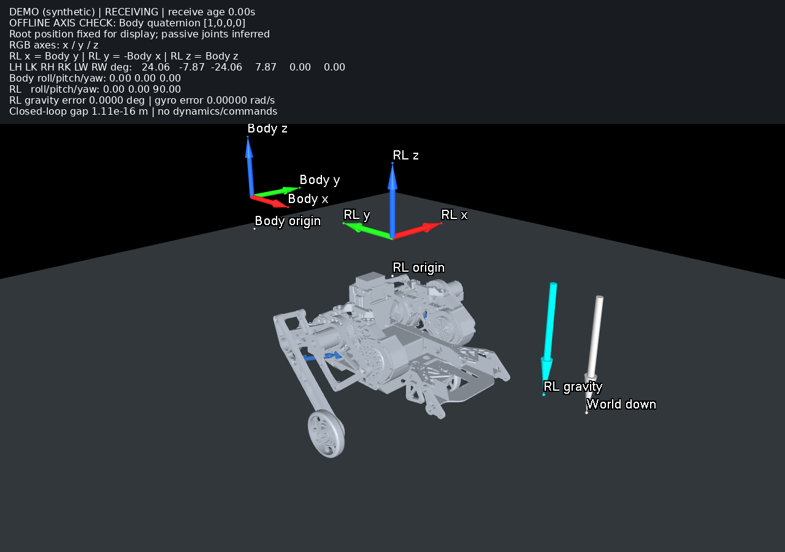

# 实车遥测 → MuJoCo 姿态对照

查看器用实车反馈摆出 V5 闭链机构，便于检查关节零点、方向和 RL 的 IMU 坐标系。数据路径为：

```text
实车 RMCS 反馈接口
  → WheelLegStateBroadcaster（50 Hz，同一采样时间戳）
  → ROS 2 话题 → Foxglove bridge → SSH 本地端口转发
  → 本机 MuJoCo：六个主动关节 + 闭链求解 + 车身姿态
```

查看器只订阅数据；不发送电机命令、调用控制服务或运行策略。MuJoCo 只更新运动学，不推进动力学。因此开查看器不会使电机使能。采样组件在 RMCS 的失能模式下也工作。

## 显示的量

| 实车 RMCS 反馈 | MuJoCo 主动关节 | 窗口标记 |
| --- | --- | --- |
| `/wheel_leg/left_hip_joint/angle` | `L_joint1` | LH |
| `/wheel_leg/left_knee_joint/angle` | `LL_joint1` | LK |
| `/wheel_leg/right_hip_joint/angle` | `R_joint1` | RH |
| `/wheel_leg/right_knee_joint/angle` | `RR_joint1` | RK |
| `/wheel_leg/left_wheel/angle` | `L_joint3` | LW |
| `/wheel_leg/right_wheel/angle` | `R_joint3` | RW |

这些角度已经是 RMCS 完成 `reversed` 和 `offset` 处理后的 URDF 坐标，查看器不再添加 offset 或改符号。`L_joint2/R_joint2` 是被动关节，不能直接填入膝电机角度。

查看器保留髋、膝的配对分支，处理 ±π 过零；12 个被动关节通过模型中的六处闭链连接求解。从模型标称装配姿态连续求解以保留装配分支；它们不是实测量。若连接误差超过 `2e-6 m`，保留上一有效姿态并显示 `POSE REJECTED`，不会偷偷修改主动电机反馈以闭合连杆。连接误差指各连接点位置差的最大绝对分量。

当前加载的 V5 导出模型已经是 `Xforward_Yleft_Zup`，其 `base_link` 跟随物理车身 Body。它与 RL 观测坐标分别计算：

```text
RL 向量 = [body_y, -body_x, body_z]
q_BR = 绕 z 轴 +90°（RL → body）
q_W_model = q_WB
q_W_RL = q_WB ⊗ q_BR
RL 预期重力 = inverse(q_W_RL) * [0, 0, -1]
```

同时订阅当前 RL 使用的 `/wheel_leg/rl/imu/projected_gravity` 和角速度，比较它们与物理 IMU 推算结果的差异。窗口显示：

- 六个主动电机角度、Body 与 RL 的 roll/pitch/yaw。
- Body、RL 两组坐标轴，红/绿/蓝分别为 x/y/z。
- 青色 RL 重力、灰色世界向下方向。
- 重力夹角误差、角速度向量误差、闭链连接误差。
- 接收状态；超过 0.5 秒没有完整快照显示 `STALE`。

### 坐标轴方向与图示

这里说的轴方向是实际空间方向，RL 三根轴在 Body 中分别是：

| RL 正轴 | Body 中的方向 |
| --- | --- |
| RL x | `[0,+1,0]`，与 Body y 同向 |
| RL y | `[-1,0,0]`，与 Body x 反向 |
| RL z | `[0,0,+1]`，与 Body z 同向 |

RL 基向量相对 Body 绕 +z 转 +90°；同一向量从 Body 分量换算成 RL 分量使用逆旋转，因此为 `[y,-x,z]`。

旧预览的箭头与文字端点错位：MuJoCo 3.5 的 OpenGL 箭头实际尖端在 `size[2]/2`，标签却放在完整长度的端点，导致 `RL y` 标签挤到 Body 一组附近。现在已让箭头尖端与标签锚点重合，分开两组坐标轴并标明各自 origin，顶部固定列出轴对应关系。依据已核对的 [MuJoCo 3.5 箭头绘制源码](https://github.com/google-deepmind/mujoco/blob/3.5.0/src/render/render_gl3.c) 修正显示长度；IMU 坐标换算仍遵循上表。

绘图回归检查 MuJoCo 场景几何，覆盖水平与组合倾斜姿态：`dot(RL y, Body x) = -1`，`RL x = Body y`，`RL z = Body z`，同时检查箭头尖端和标签位置重合。

### V5 模型本身的车头方向

修正箭头标注后，原查看器仍把 `q_W_RL` 写入了导出模型的根节点，造成整车额外转了 +90°。这层模型映射已修正为 `q_W_model = q_WB`，车头对应 Body x；顶部两组坐标轴仍按前述关系显示。

依据以下文件核对过模型的坐标转换：

- 导出包中的 `source_urdf_v5.0.urdf`：原始 CAD 的左、右髋位置分别为 `[0.1838,0,-0.00083697]`、`[-0.1828,0,0.00083241]`，左右分布沿原始 x 轴。
- `参考例程/tools/build_v5_closedchain.py`：导出时用 `S=[[0,-1,0],[1,0,0],[0,0,1]]` 处理根关节原点以及基座网格、碰撞和惯量。
- 当前加载的 `robot.xml`：左右髋已经位于 `[0,0.1838,-0.00083697]`、`[0,-0.1828,0.00083241]`；`manifest.json` 标记 `control_frame: Xforward_Yleft_Zup`。
- 另核对了 `Wheel_leg_V2/urdf/urdf_v5.0.urdf`，该文件的左右髋也已经分布在 ±y。不能仅凭同名 `base_link` 假定它与原始 CAD 坐标一致。

因此，导出模型的 +x 是车头方向，+y 是左侧方向。模型根姿态直接使用物理 IMU 的 Body → world 四元数。对同一输入，整车相对上一版绕 Body z 转 −90°，四个主动电机角度和闭链装配关系保持一致。

回归检查还从原始 URDF 读取左右髋位置，验证导出变换，再通过实际 MuJoCo 左右髋连接点连线和车身向上方向推算车头，要求它与 Body x 同向。该检查独立于 RL 箭头构造。三项几何测试覆盖模型朝向、坐标轴绘图与原有闭链重建。

**范围说明：**机身世界位置固定为 `[0,0,0.65] m`，高度只用于摆图；不从 IMU 积分位移，不代表离地高度。yaw 沿用 EKF 的参考，不能据此认定绝对航向已标定。采样时间戳是 executor 读取接口的时刻，不是各 CAN/IMU 的硬件采样时间；`RECEIVING` 仅证明遥测链路在更新，不能替代实车 `robot_status` 的反馈新鲜度检查。重力误差为零只证明两条软件坐标转换一致，仍需用实物姿态确认安装轴和 EKF 输入方向。

## 实车端准备

新增组件已接入 `rmcs_ws/src/rmcs_bringup/config/wheel-leg-infantry-rl.yaml`。部署时须包含本次 `rmcs_core` 和 bringup 配置；仅运行旧版 RMCS 的 `value_broadcaster` 不会产生以下话题。原 `value_broadcaster` 保持用于标量，新增组件负责标准 ROS 消息。

在实车的 ROS 环境、RMCS 工作空间中编译，沿用该工作空间原有的安装布局；本开发容器使用：

```bash
source /opt/ros/jazzy/setup.bash
cd /workspaces/RMCS/rmcs_ws
source install/setup.bash
colcon build --merge-install --packages-select rmcs_core rmcs_bringup
source install/setup.bash
```

路径应替换为实车实际路径。通过实车原有流程加载更新后的 `wheel-leg-infantry-rl` 配置；不要另起第二个硬件 executor。RMCS 更新需要在电机失能时安排重启，查看器不会替你重启。

| 话题 | ROS 类型 | `frame_id` |
| --- | --- | --- |
| `/wheel_leg/telemetry/joint_states` | `sensor_msgs/msg/JointState` | `rl_base` |
| `/wheel_leg/telemetry/imu_body` | `sensor_msgs/msg/Imu` | `chassis_body` |
| `/wheel_leg/telemetry/rl_projected_gravity` | `geometry_msgs/msg/Vector3Stamped` | `rl_base` |
| `/wheel_leg/telemetry/rl_angular_velocity` | `geometry_msgs/msg/Vector3Stamped` | `rl_base` |

四条消息共享一个 header 时间戳。查看器按时间戳配对，按 JointState 的名字映射电机，不依赖数组发送顺序。`imu_body` 提供四元数和角速度，未提供线加速度，其 covariance[0] 为 −1。

如果已有 Foxglove bridge，复用它并确保话题白名单包含上述四个话题。否则在与 RMCS 相同的 ROS domain/容器网络环境启动：

```bash
ros2 launch foxglove_bridge foxglove_bridge_launch.xml \
  address:=127.0.0.1 port:=8765
```

SSH 登录目标必须能访问这个 `127.0.0.1:8765`。若桥在 Docker 中，需要 host 网络或对应的 localhost 端口映射。此命令的参数已与本地 Jazzy Foxglove bridge 3.2.6 的 launch 文件核对；另见 [Foxglove 官方文档](https://docs.foxglove.dev/docs/fleet/bridge)。

## 本机运行

本机已创建 `rmcs_ws/build/wheel_leg_viewer_venv`。换一台电脑时可以用 Python 3.11+ 单独安装：

```bash
cd /path/to/RMCS
python3 -m venv rmcs_ws/build/wheel_leg_viewer_venv
rmcs_ws/build/wheel_leg_viewer_venv/bin/python -m pip install \
  -r rmcs_ws/src/rmcs_core/tool/wheel_leg_pose_viewer_requirements.txt
```

模型目录须包含 `robot.xml`、`manifest.json`、`meshes/` 和 `collisions/`。本机使用训练工程已有的完整 V5 模型包，工具不会修改它。

先确认普通 `ssh 用户名@实车IP` 可以通过密钥或 agent 登录，并已确认主机指纹。随后在本机仓库根目录运行，将占位地址替换为实车地址：

```bash
rmcs_ws/build/wheel_leg_viewer_venv/bin/python \
  rmcs_ws/src/rmcs_core/tool/wheel_leg_pose_viewer.py \
  --bundle '/home/noir/Documents/workspace/example/wheeled-legged_RL/参考例程/model/纯底盘_v5/urdf' \
  --ssh '用户名@实车IP' \
  --record /tmp/wheel_leg_real_take01.jsonl
```

`--ssh` 只建立端口转发，退出时清理自己创建的隧道。非标准端口加 `--ssh-port 端口`；桥端口可用 `--remote-port 端口` 指定。录制文件必须是新文件，防止覆盖已有测量。如果已经建立隧道，用 `--url ws://127.0.0.1:本地端口` 替换 `--ssh`。

窗口鼠标操作沿用 [MuJoCo passive viewer](https://mujoco.readthedocs.io/en/3.5.0/python.html)：可旋转、平移和缩放视角。先在电机失能、机械支撑可靠的条件下，对比已知摆放姿态，再决定是否进行主动闭环试验。查看器不会检查或改变实车的使能状态。

回放同一次实车录制：

```bash
rmcs_ws/build/wheel_leg_viewer_venv/bin/python \
  rmcs_ws/src/rmcs_core/tool/wheel_leg_pose_viewer.py \
  --bundle '/home/noir/Documents/workspace/example/wheeled-legged_RL/参考例程/model/纯底盘_v5/urdf' \
  --replay /tmp/wheel_leg_real_take01.jsonl
```

离线检查安装时使用 `--demo` 替换数据源。它会明确显示 `DEMO (synthetic)`；新录制保存来源标记，回放合成数据仍标明 `SYNTHETIC DEMO`。`--headless --duration 10 --report /tmp/pose_report.json` 可仅收数和输出指标；另加 `--screenshot /tmp/pose.png` 保存最终有效姿态。本机无窗口渲染使用 `MUJOCO_GL=egl`。

## 怎么判读

| 现象 | 先核对 |
| --- | --- |
| `missing topics` | 实车是否部署采样组件；ROS domain、桥白名单是否一致 |
| `STALE` / `disconnected` | SSH 隧道、桥连接和采样进程；冻结画面是上一帧 |
| `rejected sample` | 消息 frame、四元数有效性、四个时间戳是否一致 |
| 关节数值与日志一致，但腿形不一致 | 机械零点、offset、主动关节对应关系和被动装配分支 |
| 整车倾斜方向错误，但腿形正确 | 物理 IMU 安装轴、EKF 方向、模型基座轴 |
| RL gravity error 明显不为零 | 实际 RL 重力接口与物理 IMU 推算不一致；不要用单独调画面符号掩盖 |
| `POSE REJECTED` | 反馈无法在当前装配分支闭合；检查角度映射与模型版本 |

客户端支持旧桥 `foxglove.websocket.v1` 和新桥 `foxglove.sdk.v1`。3.2.6 本地实测要求后一种，仅请求旧协议会收到 HTTP 400。子协议依据 [Foxglove SDK 握手实现](https://github.com/foxglove/foxglove-sdk/blob/main/rust/foxglove/src/websocket/handshake.rs) 核对；客户端只发送订阅操作。

## 已完成的本地验证

- 开发容器中 `rmcs_core`、`rmcs_bringup` 完整构建通过。
- 五项离线测试通过：时间戳配对/关节名映射、无效四元数、错误坐标帧、实际 CDR 与 WebSocket 订阅、V5 闭链和坐标变换。
- 之前实车日志中的 `[-99.421532, 179.194987, 89.957478, 168.761840]°` 及等价 ±2π 输入可重建闭链；该测试的 IMU 是人为设置的参考姿态。
- 本机真实 Foxglove bridge 3.2.6 + 隔离 ROS 域合成发布源 → 查看器，收到 244 组完整数据，0 次姿态拒绝，最大连接误差约 `1.2e-14 m`。
- 该链路使用车身横滚 +20°，显示 RL 俯仰 −20°；重力和角速度与合成参考一致。
- MuJoCo GUI、无窗口渲染、JSONL 录制和回放已运行通过。当前 Wayland 环境出现窗口位置/libdecor 的非致命提示。

以上不代表已连接实车或已证实实际机械零位正确。仍需实车 SSH 地址，并确认实车运行含上述组件的版本后完成现场对照。

离线测试命令：

```bash
WHEEL_LEG_MODEL_BUNDLE='/home/noir/Documents/workspace/example/wheeled-legged_RL/参考例程/model/纯底盘_v5/urdf' \
  rmcs_ws/build/wheel_leg_viewer_venv/bin/python \
  rmcs_ws/src/rmcs_core/test/test_wheel_leg_pose_viewer.py -v
```

以下预览使用车身四元数 `[1,0,0,0]` 的水平合成姿态：车头沿 Body x，RL y 与车头反向，RL x 沿车身左侧。它不是实车截图：


