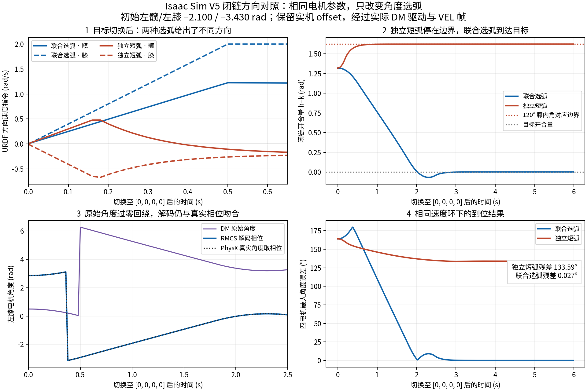

# V5 双电机速度闭环：单圈相位与闭链开合

## 标定核实

四路顺序为 `[L_joint1, LL_joint1, R_joint1, RR_joint1]`，对应 RMCS 的左髋、左膝、右髋、右膝。这里的“膝电机”是机身上的第二主动轴，不能当作大小腿之间的被动膝关节。

保留实机 offset `[-1.6, -2.93, +1.6, +2.93] rad`，四路均 reversed。DM 原始相位为零时，URDF 相位就是这些 offset：

```text
q_phase = remainder(offset - raw, 2π)
```

V5 六闭环求解：标定姿态的被动膝内角约 **105.02°**；按髋→膝、膝→轮心向量量得约 **104.99°**。左大腿单位方向约 `[0.02920, 0.00460, 0.99956]`，与 +z 相差约 1.69°，右侧镜像。用户已确认保留这组 offset，标定角约105°。随机上电朝向不改变这一腿部开合关系；105±5°用于验证初始姿态，不用于偷偷修正 offset。

训练名义姿态仍为 `[0.42, -0.13742282595254576, -0.42, 0.13741557625658019]`。它与电机内部零点不同，RL 的模型、观测维数和名义角不变。

### 当前遥控映射

| 左拨杆 | 右拨杆 | 控制 |
| --- | --- | --- |
| 下 | 下 | 失能、清除控制状态 |
| 下 | 中 | URDF 零点 `[0,0,0,0]` |
| 中 | 上 | 电机标定零点，即四个 offset |
| 中 | 中 | RL |
| 中 | 下 | 保持进入模式时的位置 |
| 其他有效组合 | | 保持当前位置 |

遥控 UNKNOWN 也失能。此表对应当前代码；此前把“左中右下”说成固定零位模式不适用于这版映射。

## 两个电机共同闭环

原来 `ContinuousAngleTracker` 独立累计四路圈数，控制器再保存膝电机整数圈偏置、推进电机位置轨迹，并在超界时叠加速度前馈。该链路已移除。DM `/angle` 现在是有界相位，驱动没有历史圈数。

设左右符号 `s=+1/-1`，两路当前相位为 `h,k`：

```text
d = wrap(s·(h-k))                 # 同一机械装配分支内的开合量
c = wrap(h-s·d/2)                 # 整腿的共同转向

e_c = wrap(c_target-c_measured)   # 只对共同转向选弧
e_d = d_target-d_measured        # 开合误差不能独立选短弧

v_hip  = kp·e_c + s·kp·e_d/2
v_knee = kp·e_c - s·kp·e_d/2
```

两路速度按同一比例限幅，再以同一比例限制本周期变化；临近机械边界时，阻止继续向外运动优先于普通加速度斜坡。默认 `2 rad/s`、`4 rad/s²`；1 ms 更新时，首次速度不超过 `0.004 rad/s`。相对于上一周期指令，仅保留速度斜坡状态。没有每轴位置积分、圈数偏移、脱离实测反馈推进的位置参考或超界前馈。

- 电机在标定 raw=0 处跳到2π，或 URDF 相位跨±π，`c,d`及反馈增量都用相位计算，运动方向连续。
- 同侧两个电机可以同向或反向；取决于同时要求转向还是改变开合。不会分别选短弧把它们带向不同装配支路。
- 当共同转向误差接近π时，沿上一周期已选的共同运动方向，避免量化噪声让选弧反复翻转。
- 目标开合量被投影到机械工作区内，保留共同转向；反馈越过工作区和0.03 rad容差后停止。不存在大速度“自动纠偏”。
- 运行中的反馈失效、跳变、更新间隔超过50 ms等锁存控制器故障，清零四路速度。双下/失能会清除故障、速度斜坡、时间和反馈历史。

### 工作区依据

V5 闭链直接求解得到：

| 被动膝内角 | 左侧 d | 右侧 d |
| ---: | ---: | ---: |
| 30° | −0.473722737 | −0.473740465 |
| 100° | 1.229891669 | 1.229885705 |
| 105° | 1.329577838 | 1.329571860 |
| 110° | 1.428467881 | 1.428461835 |
| 115° | 1.526675494 | 1.526669322 |
| 120° | 1.624296605 | 1.624290244 |

控制范围为 `[-0.47376, 1.62433] rad`，含CAD轴向舍入余量，目标向内留0.04 rad。120°已直接闭链求解，不再使用旧值1.62892的线性外推。角度日志使用5°间隔表插值，仅供诊断，速度环直接使用实测 d。

## 使能与失能排查

四个DM保持调试助手设置的 **VEL**。速度帧仍为 `0x200+ID`、小端 float32 rad/s、后四字节0；系统帧沿用基础ID。帧格式依据[DM8009手册](https://docs.openarm.dev/assets/files/dm8009-90ee7f15d06666e15afd49e5d5417150.pdf)与[达妙SDK](https://github.com/dmBots/motor-sdk/blob/main/Python%E4%BE%8B%E7%A8%8B/u2can/DM_CAN.py)。

启动流程（收到实车右侧随机未使能日志后修订）：先清错并持续零速度50 ms；同总线左右电机的系统命令错开发送。每台都必须收到FC之后的新鲜 `status=1`，四台同时稳定50 ms后才开放运动。启动期间只对尚未确认的电机重试FC，单台间隔至少100 ms，总启动时限2 s；超时锁住零速度。正常工作由连续VEL帧维持通信，不周期性发送FC；运行阶段失去就绪后锁住门控，双下复位后才重新启动。详见[使能链路排查与修复](wheel_leg_dm_startup.md)。

原代码在启动序列内将 `joint_control_active` 无条件设真，角度参考会提前推进；首个运动周期又能立刻达到2π rad/s。现已修正这些确定的启动冲击来源。由于实机当次没有日志，不能断言它们就是约0.5 s后status变0的唯一原因。

控制器不可用时发送零速度，保持现有“仅双下/遥控丢失等取消使能请求才发FD”的行为。电机status=0表示失能，不能直接解释成CAN故障。轮电机也受到关节运动门控约束。

`/rmcs/service/robot_status` 现在包含：

- `controller_reason`：当前具体异常，如第几路反馈断续或哪条腿不在V5装配分支。
- `first_unavailable`：首次异常时 LH/LK/RH/RK 的status、反馈年龄、反馈速度、指令速度；退出使能后仍保留，下一次使能才清除。
- `phase`、`ever_active`、`pending_mask`、`FC_attempts`：区分启动超时与运行中失能，记录哪台电机未确认及各自重试次数。
- 每台DM的 `status/fault/feedback_age_ms`。

首次异常同时打印 `[joint_enable] first unavailable`，避免之后全是零速度时丢失最初线索。

## 可复现验证

纯C++测试覆盖随机整腿朝向、机械区间全程、镜像、独立电机相位表示、标定跨零、短弧误选案例、启动门控及运行阶段无周期FC。DM帧测试还覆盖校准零点两侧的真实16位反馈量化、断线复连不积累圈数。

动态仿真使用 `tool/validate_wheel_leg_pair.py`，通过C ABI调用生产C++算法，读取YAML参数。需要本机Isaac Lab 2.3/Isaac Sim 5.1环境与外部V5模型包：

```bash
OMNI_KIT_ACCEPT_EULA=YES /home/noir/miniconda3/envs/isaaclab/bin/python \
  rmcs_ws/src/rmcs_core/tool/validate_wheel_leg_pair.py \
  --bundle /home/noir/Documents/workspace/example/wheeled-legged_RL/参考例程/model/纯底盘_v5/urdf \
  --output /tmp/wheel_leg_pair_dynamics.json --envs 16 --device cpu
```

每个实例保留19刚体、6闭链约束，固定基座、重力开启，交替启用/关闭气簧。初始朝向随机，初始膝角包括100/105/110°及120°边界；依次运动至URDF零位、标定零位、训练名义姿态，再往返跨过标定零点。初始化后不写从动关节位置，不在物理步内调用几何求解器。

仿真速度内环是明确假设的PI（P=10、I=50、40 Nm限幅、主动轴附加惯量0.02 kg·m²），并未辨识DM实机参数。研究模型原膝限位35–80°临时扩展到30–120°，气簧滑块下界临时设−0.012 m；这些改动仅存在于仿真stage，不修改外部资产。动力学结果可验证闭链运动路径，不能代替实机惯量、摩擦、速度环和机械行程标定。

Isaac接口按[官方API](https://isaac-sim.github.io/IsaacLab/v2.3.0/source/api/lab/isaaclab.assets.html)和本机安装源码核对；本会话未提供可调用的Context7工具。

### 本次结果（2026-09-26）

[完整动态结果与模型/控制器哈希](wheel_leg_v5_pair_validation.json)。16个实例×5个目标阶段，每阶段6 s、步长1 ms，共480机器人秒：

- 全部目标到达；最大终点电机误差0.001305 rad（0.0747°）。
- 最大六闭环间隙0.00005141 m（0.05141 mm）；装配分支反馈异常0次。
- 实际膝内角范围30.0044–120.0001°，未越过30–120°工作区（上端浮点误差约0.00002°）。
- 最高指令2 rad/s；四路均实际跨越标定raw=0。
- 同时覆盖有/无气簧。开启TGS的 `enable_external_forces_every_iteration`；默认关闭时，带气簧的速度反馈残差使最差终点误差达到0.04664 rad，未通过0.04 rad阈值。修正的是仿真外力积分设置，RMCS算法及验收阈值保持不变。

ROS开发容器内 `rmcs_core` 编译通过。`dm_motor_test` 六项测试及 `wheel_leg_joint_pair_geometry_test` 全部通过；后者包含594组不同初始状态/目标、左右镜像、速度限制与启动时序。YAML参数集合、标定offset、RL名义角和插件注册核对通过。

上述验证完成时还没有当次0.5 s失能的实车日志。随后用户提供了右髋新鲜 `status=0`、控制器健康的日志，并确认板卡关闭CAN自动重发；追加排查及启动修复见[使能链路记录](wheel_leg_dm_startup.md)。

## 标定反馈与转动方向的闭链对照

用户进一步明确要排查的是：**两电机闭环选择的转动方向与闭链可行路径冲突，导致无法到位**。为此增加了实际组件反馈链路，并单独做相同电机参数下的方向对照。

### 实际经过的链路

```text
PhysX 闭链真实关节角
  → 按实机 offset、reversed 重建单圈编码器原始角
  → 14位编码器量化 + DM CAN POS16/VEL12/T12 打包
  → 生产 DmMotor::match_then_store_status / update_status
  → 实际 WheelLegJointVelocityController 组件
  → 生产 DmJointEnableSequence 使能门控
  → 生产 DmMotor::generate_velocity_command 的 VEL 字节
  → 仿真电机速度内环产生力矩
  → PhysX 积分全部主动/从动关节与六闭链约束
```

`test/wheel_leg_dm_sim_bridge.cpp` 在ROS容器内实例化实际组件，通过二进制管道与Isaac通信。`update_at()` 只注入仿真时间；正常运行的 `update()` 仍使用真实steady clock。这里验证驱动、控制器和使能序列；未实例化USB板卡、遥控解析、RL推理或真实CAN总线。

没有实车采集日志可回放。编码器分辨率、原始角范围、反馈周期、速度PI及机械负载均为记录在报告中的仿真假设；实机四路轴向与ID映射沿用当前YAML，不能据此反证实车接线和方向配置正确。

### 方向冲突反例：只改变选弧

初始左侧真实角约 `[-2.100, -3.42957] rad`，膝内角105°。电机内部标定后的raw约 `[0.50008, 0.49969] rad`。经过真实驱动与量化，RMCS收到的角度相位为 `[-2.099924, +2.853643] rad`。目标为URDF零位 `[0,0]`。

| 控制方式 | 起始误差选弧（髋、膝） | 6 s后四路最大误差 | 结果 |
| --- | --- | ---: | --- |
| 逐电机独立短弧反例 | 约 `+2.100, −2.854` rad | **2.331595 rad / 133.5906°** | 开合量被带到120°边界，无法到位 |
| 当前髋膝联合选弧 | 约 `+2.100, +3.430` rad | **0.000476 rad / 0.02727°** | 到位，跨零时方向连续 |

两组的模型、初始姿态、重力、offset、编码器、速度PI、延迟均相同，气簧均关闭；共用生产速度、加速度和边界限制。独立短弧组只在测试桥接中替换角度误差的选择方式，是用来验证机制的反例，**不是某一历史提交的原样回放**。

另两组从精确标定姿态 `[-1.6,-2.93,+1.6,+2.93]` 出发，联合选弧与独立短弧都到达零位，最大误差分别0.02726°、0.02732°。因此，“刚好在标定姿态能够到位”不能覆盖上电姿态改变或角度回绕后的方向问题。

同侧两电机反向运动可以用于改变腿部开合；不能仅凭正负号相反就认定打架。这里的故障是独立选弧使开合量向错误边界运动，随后停住而仍有大角度残差。当前控制器根据同一装配分支共同选择路径，解决了这个仿真反例。



[方向对照完整结果](wheel_leg_v5_direction_validation.json)：4个实例，1 ms步长；复跑结果相同；最大闭环间隙0.01597 mm，控制器反馈异常0次。

[方向对照时间序列](wheel_leg_v5_direction_validation.trace.npz)保留每20 ms的真实关节角、解码反馈、目标、速度指令、力矩、raw角与真实速度，可直接用于绘图，无需重跑物理仿真。

### 完整反馈链路覆盖结果

[完整DM反馈链路结果](wheel_leg_v5_dm_feedback_validation.json)：16个实例，每个48.04 s，共768.64机器人秒。覆盖精确标定raw=0、不同初始整腿朝向、`[0,2π)` / `[-π,π)` 两种原始角表示、URDF零位、标定零位、训练名义目标、标定零点两侧往返，以及显式失能后重新使能。该扩展覆盖另外包含响应/延迟差异，用于补充验证；上面的方向对照使用完全相同的电机参数。

- 所有使能目标阶段到位；最大终点误差 **0.000936715 rad / 0.05367°**。
- 实际驱动解码与对应采样时刻PhysX角度的最大相位误差 **0.00057303 rad**，在模拟编码器及CAN量化误差内。
- 四路无符号原始角跨标定零点次数分别为 `[59,43,60,56]`，没有被误判为反馈跳变。
- 控制器异常0次，运动门控关闭时非零速度帧0次，使能请求保持期间FD失能帧0次。
- 最大闭环间隙 **0.06734 mm**；膝内角35.8128–120.0001°。
- 高力矩、明显位置残差且同侧两电机近乎停止的连续条件最长0.021 s，未发生持续卡住；此指标不能代替实车内力测量。

复现前在ROS容器中用 `BUILD_TESTING=ON` 编译 `rmcs_core`，然后：

```bash
# 完整反馈链路
OMNI_KIT_ACCEPT_EULA=YES OPENBLAS_NUM_THREADS=1 /home/noir/miniconda3/envs/isaaclab/bin/python \
  rmcs_ws/src/rmcs_core/tool/validate_wheel_leg_pair.py \
  --bundle /home/noir/Documents/workspace/example/wheeled-legged_RL/参考例程/model/纯底盘_v5/urdf \
  --output /tmp/wheel_leg_dm_feedback_validation.json --envs 16 --device cpu --dm-feedback

# 相同速度环下的方向对照
OMNI_KIT_ACCEPT_EULA=YES OPENBLAS_NUM_THREADS=1 /home/noir/miniconda3/envs/isaaclab/bin/python \
  rmcs_ws/src/rmcs_core/tool/validate_wheel_leg_pair.py \
  --bundle /home/noir/Documents/workspace/example/wheeled-legged_RL/参考例程/model/纯底盘_v5/urdf \
  --output /tmp/wheel_leg_direction_validation.json --device cpu --direction-comparison

# 从同名.trace.npz中的实测仿真时间序列绘图
/home/noir/miniconda3/envs/isaaclab/bin/python \
  rmcs_ws/src/rmcs_core/tool/plot_wheel_leg_direction.py /tmp/wheel_leg_direction_validation.json \
  --output /tmp/wheel_leg_direction_validation.png
```

报告包含生产代码与模型哈希。完整反馈测试之后，测试桥接增加了独立短弧对照选项，所以两份报告的桥接哈希不同；生产驱动、控制器、配对几何及使能序列保持相同。脚本退出前使用Isaac Lab的公开 `clear_instance()` 取消等待Play的STOP回调；方向对照已验证正常退出。

本轮 `rmcs_core` 编译通过，已有DM六项gtest和配对几何/使能序列测试全部通过。这些JSON是当时的验证快照；随后改动了使能序列，新的闭链回归结果与实车日志分析见[使能链路记录](wheel_leg_dm_startup.md)。尚未实车复测。
