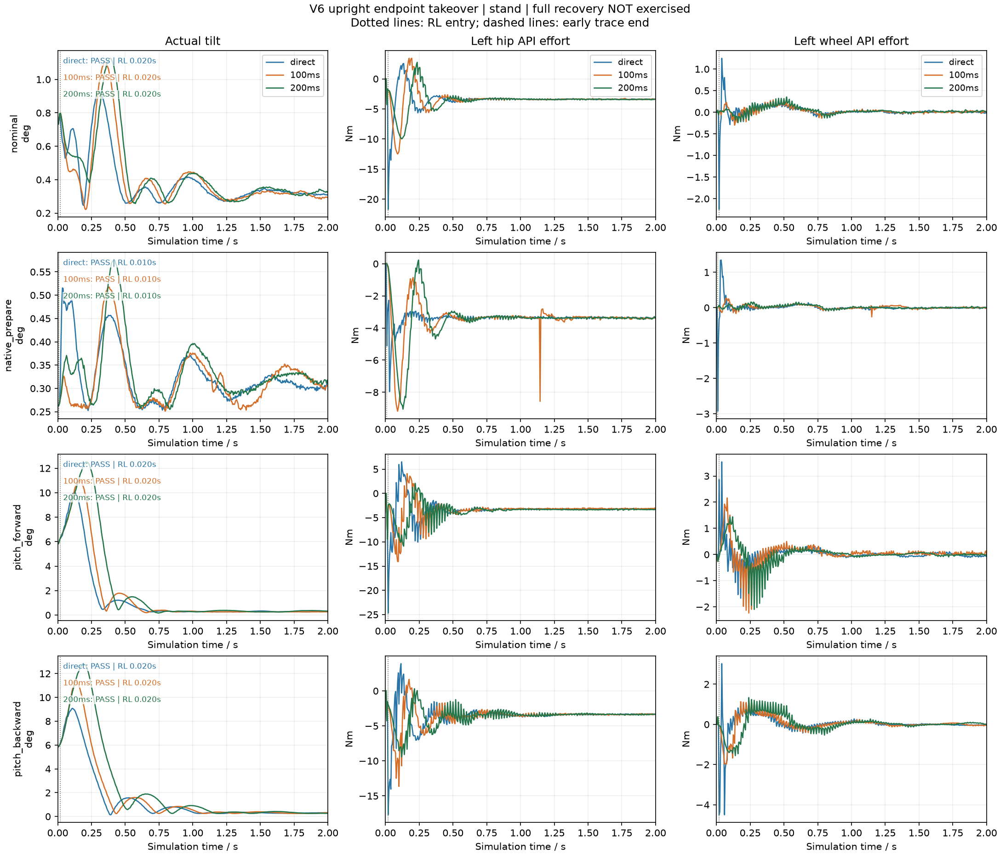

# V6 原生机构与生产 C++ 控制闭环仿真：2026-10-03

本次已经将实际 `WheelLegChassisController`、`RlController` 和 `OnnxPolicy` 接入 Isaac 的冻结 V6 机构，完成自由底盘的动力学闭环。`matrix_paced` 的 10 项完整运行中有 9 项通过；430 mm 高度项未通过。另有 261 项 C++ gtest 零失败，33,770 帧公开 actor 输出与同一 ONNX 的独立回放对照通过。上述证据覆盖当前软件接入与单环境名义仿真，不构成实机验收。

普通正立接管的 direct / 100 ms / 200 ms 比较已完成：四种初态各运行 16 s，12/12 项通过。静态 `native_prepare` 端点可以通过混合减小入口力矩跳变；带 pitch/角速度/平动扰动时，混合增大了前两秒倾角和速度峰值。本轮保留 `v6_takeover_blend_seconds=0`，100 ms 保留为可选的静态端点柔化参数，不推荐默认采用 200 ms。

**完整 V6 倒地恢复仍禁用。这里没有执行完整自起轨迹，也没有全自起成功率。** `native_prepare` 是由冻结 V6 几何计算得到的 episode 初态，不是观测到的脚本成功末态。旧 V5 自起回归不能作为 V6 自起证据。初次模型接入、硬件映射和历史 242 项测试记录见[模型部署文档](wheel_leg_v6_model_deployment_20261003.md)。

## 实际闭环与执行周期

宿主机 Python 只负责原生 Isaac 环境、传感器采样、遥控输入、接口换算、日志和评分。独立 Unix socket 的另一端运行生产 C++ Component：chassis 解码 DR16/键盘语义，`RlController` 完成使能、PREPARE/RL、观测、ONNX 推理、PD、机械软约束和 API 力矩输出。Python 不再解码 actor 动作或计算腿/轮 PD。

Isaac 使用交接绑定的 V6 `232 mm / stop105` 资产和原生控制/物理配置。`matrix_paced/report.json` 的 startup 回执记录：19 个刚体、18 个树关节、6 条闭链约束，整机质量 `13.886000633239746 kg`，气簧力启用。底盘根刚体自由，`fixed_base=false`、`external_guide=false`；每次 episode reset 后至下一次 reset 前不注入状态，reset 本身允许设置完整初态。自碰撞在这个名义回放配置中关闭，不能由本次结果证明自碰撞安全。

| 周期 | 实际行为 |
| --- | --- |
| 5 ms / 200 Hz | Python 读取一次机构与理想 IMU 状态，生成不可变传感器快照；Isaac 推进一步物理 |
| 1 ms / 1 kHz | 同一快照连续执行 5 次生产 chassis + RL `update()`；bridge 实际按 steady clock 等待这些 tick |
| 20 ms / 50 Hz | C++ 更新 actor 和策略目标，其间持有目标 |
| 5 ms / 200 Hz | C++ 根据最新快照计算 PD；两次物理状态刷新之间持有力矩 |

因此这里验证的是“200 Hz 新反馈 PD + 1 kHz executor 持有重发”，不是“每 1 ms 刷新物理与电机反馈”。Python 将 C++ 力矩经过原生电机转速相关包络、识别的轮侧 actuator response 后施加一次，再叠加被动气簧力；没有重复添加轮摩擦、armature 或额外 Python 控制器。

原生环境的 `startup_report.control_timing.runtime_substep_verification` 仍为 `pending_first_step`：本入口直接调用 `env.sim.step()`，不经过原生训练 `env.step()` 的控制审计器。本入口的周期证据来自 bridge 的明确执行循环、采样时间/序号和逐物理帧 trace，不将该原生审计字段解释为已通过。

## 轴顺序、单位与 IMU

控制使用 X 前、Y 左、Z 上。策略/API 顺序 P 与原生环境控制顺序 C 必须区分：

```text
P = [L_joint1, LL_joint1, R_joint1, RR_joint1, L_joint3, R_joint3]
C = [L_joint1, LL_joint1, L_joint3, R_joint1, RR_joint1, R_joint3]
P -> C = [0, 1, 4, 2, 3, 5]

SIGN   = [-1, -1, -1, -1, +1, +1]
OFFSET = [1.6, 2.93, -1.6, -2.93, 0, 0]
q_api   = (q_P - OFFSET) * SIGN
dq_api  = dq_P * SIGN
tau_P   = tau_api * SIGN
```

角度为 rad，速度为 rad/s，API 力矩为输出轴 N·m。四腿传入 API 后，生产配置 `J=-I` 和对应 offset 将其还原为 V6 模型角；力矩也只做一次对应符号换算。LK/RK 是第二主动轴，不是被动内膝角。两轮 API 已在真实驱动中使用输出侧单位；仿真接口没有再次乘除 15.8。模型左右轮轴方向相反，正向轮速为 `[+v/0.06,-v/0.06]`；这不证明真实 M3508 的逐轮方向已经验收。

Isaac 四元数为 `xyzw`，发送到 C++ 前重排为 `wxyz`。gyro 使用车体坐标的 `root_com_ang_vel_b`，单位 rad/s；IMU 安装外参使用单位阵。加速度由根 link 世界线速度差分获得，再加世界 `[0,0,9.81] m/s²` 并旋转回车体，表示加速度计 specific force，静止正立时约为车体 +Z 的重力幅值。它没有经过真实 BMI088 的采样、SPI、标定和 EKF；不能把 Isaac 四元数当作已经验证了 BMI088 姿态输出。

C++ 接收电机角/速度/力矩、四元数、gyro 和 specific force；用于评分的真实平动速度、高度、接触力和闭链残差只保留在 Python 诊断与 trace 中。该名义入口使用理想、无噪声传感器，没有测试电机编码器噪声、BMI088 偏置、传输丢包或实物安装误差。

## 门控与运行边界

V6 普通控制即使 `recovery_enabled=false`，仍启用严格反馈检查：六轴电机最大年龄 20 ms，姿态/gyro 最大年龄 20 ms，加速度最大年龄 30 ms，各流最大时间跨度 10 ms，并检查样本序号、有限值与 DM 状态。推理返回、输出力矩之前再次检查。bridge 按真实 steady clock 生成当前采样时间；不会把每个 1 ms executor tick 伪装为一个新物理样本。宿主机处理变慢会反映为 wall sample interval 和下一帧控制检查，而不是通过放宽生产阈值掩盖。

仿真进程显式使用 `--simulation-only`，只在自身 ROS 参数作用域将 `calibration_ready/soft_limits_ready/imu_alignment_ready` 设为 true。仓库硬件 YAML 的标定与软限位门控仍为 false；launcher 不打开 CAN/USB，也不修改在运行的硬件进程。双下清使能和 API 力矩；双下后双中建立新的控制会话。普通 V6 超过 45°倾角锁存退出，不自动运行旧 V5 自起。

V6 正立入口取消了旧 V5 的 0.25 s 静态 PREPARE dwell。自由底盘不能要求尚未执行平衡的静态腿 PD 先保持平衡，因此改为在有界 capture 域内立即交给 actor：`prepare_max_tilt_rad=0.2`（约 11.46°）、车体 gyro norm≤1 rad/s、四腿相对 nominal 的 wrapped error≤0.15 rad、腿速绝对值≤2 rad/s、轮速绝对值≤5 rad/s，同时必须满足新鲜传感器、DM 控制就绪与主动轴差值内界。该差值为 `d_left=q_LK−q_LH`、`d_right=q_RH−q_RK`，当前要求在 `[−0.110638855,1.299574849] rad`；不将该值称为被动膝角。通过门限的当帧即可首次计算 actor，力矩仍遵循 200 Hz PD 相位，最迟在后续 4 ms 内更新。旧 V5 recovery/dwell 回归保持原语义；参数回执仍出现 `prepare_stable_seconds=0.25` 不表示 V6 正立 capture 会等待该 dwell。

`matrix_paced` 的 trace 共 33,900 个物理样本、169.5 s 仿真时间；各 case 的 wall 时间合计 `271.4607898510003 s`，含初始化的整个运行区间约 280.555 s。各 case wall sample interval 的 p95 为 9.042–9.672 ms，全矩阵最大值 15.786324 ms，超过 20 ms 的采样间隔为 0。缓存的最后一次 ONNX 耗时 p95 为 86.175–90.457 µs、最大 200.890 µs，PD 耗时 p95 为 5.495–5.714 µs、最大 74.876 µs。这些耗时是逐传感器帧读取的“最近一次调用耗时”，帧数不是推理或 PD 调用次数。

## 运行与重新生成结果

从 RMCS 仓库根目录运行：

```bash
.script/simulation/run_v6_cpp_isaac.sh --headless
```

默认入口检查 `~/isaacsim60-venv/bin/python`、相邻训练仓库 `../robot_rl/isaac_wheeled_rl_schedule` 和 Docker 容器 `rmcs-rmcs-develop-1`，构建生产 `rmcs_rl` 与独立 bridge。可用 `RMCS_ISAAC_PYTHON`、`RMCS_TRAINING_REPO`、`RMCS_SIM_CONTAINER`、`RMCS_CONTAINER_ROOT` 覆盖路径。仅已构建且身份明确时使用 `--no-build`。

每次调用创建独占 `isaac_PID.sock` 和独立 bridge，等待 socket 就绪至多 10 s；退出时向自己的 bridge 发送 shutdown，必要时仅清理与该 socket/可执行文件对应的 PID，不使用广泛 `pkill`。默认输出是带时间戳与 PID 的新目录；`--output` 也必须指向尚不存在的目录。入口不会关闭原有 Isaac GUI、TensorBoard 或训练。省略 `--headless` 可以查看本次新创建的 GUI。

```bash
# 一秒 smoke；缩短的 case 不能判通过
.script/simulation/run_v6_cpp_isaac.sh --headless --cases stand --seconds 1

# 接管 A/B/C：分别把 --blend-seconds 设为 0、0.1、0.2；每次使用新的输出目录
.script/simulation/run_v6_cpp_isaac.sh --headless --cases stand \
  --initial-profiles nominal native_prepare pitch_forward pitch_backward \
  --blend-seconds 0.1 --output NEW_RUN_DIRECTORY

# 原运行只读；重建单次图/汇总，或比较三个运行
python3 -B .script/simulation/summarize_v6_cpp_sim.py RUN_DIRECTORY
python3 -B .script/simulation/compare_v6_takeover.py DIRECT_DIR RUN100_DIR RUN200_DIR \
  --output NEW_COMPARISON_DIRECTORY
```

每次运行保存 `report.json` 与逐 case JSON；汇总器另写 `summary.json`、`summary.md`、`trajectory.png`，不覆盖原 report。比较器核对模型/合同/资产身份、记录的源码 hash、初态、case、周期，以及已公开的 bridge 参数，唯一允许的参数差异为 blend 时长。不匹配会输出 INVALID 比较并返回非零；早停、短跑、缺 trace 或未进入 RL 不会变成通过。源码 hash 与参数记录是复现凭据，不是已加载二进制的密码学证明；未公开的参数仍需由 launcher 的受限 override 和源码/YAML 身份约束。

## matrix_paced 精确结果

本次运行在 `2026-10-03T02:07:38.784410+00:00` 开始，`02:12:19.339504+00:00` 结束。所有项达到完整时长，统一单环境/seed `190619`，从正立 nominal release 初态开始，RL 入口均为 0.020 s。命令在第 4 s 起施加；高度输入采用生产 6 s smoothstep。平动/yaw 稳态通常取第 6 s 起，高度取第 12 s 起；forward/backward 的运动评分在第 16 s 前，停止另取第 18 s 后。

| Case | 命令 | 时长 s | 结果 | vx MAE m/s | yaw MAE rad/s | 高度 MAE mm |
| --- | --- | ---: | --- | ---: | ---: | ---: |
| stand | 0 / 0 / 305 mm | 16 | PASS | 0.005406 | 0.003263 | 0.339584 |
| forward_stop | +0.5 m/s，16 s 后停止 | 20 | PASS | 0.016849 | 0.007369 | 0.028215 |
| backward_stop | −0.5 m/s，16 s 后停止 | 20 | PASS | 0.012901 | 0.002722 | 0.384676 |
| yaw_positive | +1 rad/s | 16 | PASS | 0.009080 | 0.011161 | 0.114952 |
| yaw_negative | −1 rad/s | 16 | PASS | 0.021275 | 0.012249 | 0.468368 |
| spin_negative | SPIN −1 rad/s，平动清零 | 16 | PASS | 0.021275 | 0.012249 | 0.468368 |
| spin_positive | SPIN +1 rad/s，平动清零 | 16 | PASS | 0.009324 | 0.011490 | 0.116624 |
| height_low | 230 mm | 22 | PASS | 0.002727 | 0.011899 | 0.162104 |
| height_high | 430 mm | 22 | FAIL | 0.024876 | 0.004429 | 5.138953 |
| disable | 第 5 s 双下 | 5.5 | PASS | 不计 | 不计 | 不计 |

forward/backward 停止后的平均速度分别为 `0.005024300624381604 / 0.005171765232405937 m/s`，低于 0.03 m/s 阈值。230 mm 项最终高度 `0.2301238477230072 m`。双下项验证的是第 5.005 s 起 `enable_request=false` 与全部 API 力矩为零，不要求失能后的机构继续保持站立。

430 mm 项完整跑满 22 s，没有倒地、机构失败或非轮接触失败；失败的是 `height_tracking` 与 `stand_drift`。最终高度为 `0.42486193776130676 m`，稳态高度 MAE `0.005138953130641988 m` 超过 5 mm；静止漂移 `0.24943374901890578 m` 超过 0.1 m。本记录保留 FAIL，不能称为“230–430 mm 全域通过”。

原始身份与机器可读结论：[report](artifacts/v6_cpp_sim_20261003/matrix_paced/report.json)、[独立 summary](artifacts/v6_cpp_sim_20261003/matrix_paced/summary.json)、[汇总表](artifacts/v6_cpp_sim_20261003/matrix_paced/summary.md)、[轨迹图](artifacts/v6_cpp_sim_20261003/matrix_paced/trajectory.png)。report SHA-256 为 `a96e8849bfafc496ae993e8332a6995f8bbbe45f7008d64b2c30de38d5a86bdf`，summary 为 `5d2fe864c729487729ab81f60a34f6a87f6ac06ef21795e95d60bfcc7f49d039`。

### 430 mm 高位裕度诊断

[仅仿真将 hinge_margin 设为 0 的诊断](artifacts/v6_cpp_sim_20261003/height_high_margin_zero/report.json) 完整运行 22 s，物理 40–105° 止挡保持不变。[裕度比较回执](artifacts/v6_cpp_sim_20261003/height_high_margin_zero/hinge_margin_comparison.json) 确认模型、合同、资产、初态、物理配置与记录的源码身份相同；高度 MAE 增加 `0.09888219928693776 mm`，该项仍因高度误差失败，其他检查通过。

| 指标 | 生产 margin=0.03 rad | 诊断 margin=0 rad |
| --- | ---: | ---: |
| 稳态平均平动速度 m/s | 0.024922201 | 0.001127720 |
| 稳态漂移 m | 0.249433749 | 0.009688596 |
| 高度 MAE mm | 5.138953 | 5.237835 |
| 最终高度 mm | 424.861938 | 424.745888 |
| 结果 | FAIL：高度、漂移 | FAIL：高度 |

取消软件保护裕度降低了漂移，却没有获得 430 mm 高度，支持“裕度影响高位漂移、高度问题不能仅靠取消裕度修复”的解释。只读原生 `scripts/recovery_static_targets.py::RecoveryStaticTargetBuilder.balanced_pose` 的封存 CAD 求解也提供旁证：合法 104.999° 近止挡姿态的 COM 平衡、双轮平地支撑 root 高度为 `0.4254299883862516 m`；归一主动轴差值约 1.329558 rad。软件内界 1.299574849 rad 附近约对应 103.49°，同一静态平衡分支的高度约 `0.4217388634322983 m`。这些是名义静态平衡分支的几何结果，不声称任意姿态的全局高度上限。生产 `hinge_margin=0.03` 保留；不通过改评分阈值或修改历史 report 将此项改成通过。

## 接管比较：完整运行，但没有完整自起

四种初态仅在 episode reset 写入一次：nominal 使用原生名义闭链 release 与固定 seed 小抖动；`pitch_forward/backward` 保持完整关节名义值，整机 pitch 设为 ±0.10 rad、车体 pitch rate ±0.4 rad/s、车体 vx ±0.1 m/s，轮速度为 `[v/0.06,-v/0.06]`。root 速度按姿态旋转到世界坐标。带 pitch rate 时轮心速度还包含刚体转动项，该轮速初始化不称为严格无滑动匹配。

`native_prepare` 使用冻结 `v6_recovery_profiles_v1.json` 的 `prepare_reference.full_joint_positions`、root quaternion 与约 0.305 m 高度，所有速度为零；两側被动膝约 63.86647°，闭链残差 `1.27e-16 m`。这是 V6 的 COM 平衡几何候选。其补偿 `pd_control6_rad` 不是物理 reset pose，原文件仍为 `dynamic_validation_passed=false`。本测试没有重放该端点之前的倒地/抬起脚本，也没有把 V6 候选资产改写为已验证恢复 profile。

混合只作用于普通 V6 PREPARE→RL：冻结最后的 prepare 姿态，每个 200 Hz 新反馈重新计算 prepare 腿 PD 80/2、轮阻尼 `−0.2*dq`；actor 从首个 RL tick 起运行，用 smoothstep `alpha=3t²−2t³` 混合 prepare 与 actor 的六轴力矩，随后进行 native 限幅、机械软约束和 API 映射。它没有改变 Legacy V5 recovery。持续时间 0 表示直接进入 RL；0.1/0.2 s 分别为 100/200 ms 混合。

三次运行模型、合同、资产、记录的控制源码 hash、四种完整初态和已公开的 bridge 参数一致，仅 blend 参数不同。[比较回执](artifacts/v6_cpp_sim_20261003/takeover_comparison/takeover_comparison.json) 确认 `comparison_valid=true`、`all_runs_complete=true`、`all_runs_passed=true`：12 项各 16 s、共 38,400 个物理样本，`native_prepare` 在 0.010 s 进入 RL，其他初态为 0.020 s，后续保持 RL 且稳态检查通过。

| 初态 | 混合 ms | 前2 s 倾角峰 ° | 平动速度峰 m/s | RL 入口最大轴跳变 N·m | 前2 s 最大帧间轴跳变 N·m |
| --- | ---: | ---: | ---: | ---: | ---: |
| nominal | 0 | 0.928306 | 0.027010 | 20.023841 | 20.023841 |
| nominal | 100 | 1.106061 | 0.035454 | 10.662767 | 10.662767 |
| nominal | 200 | 1.126744 | 0.038062 | 10.662767 | 10.662767 |
| native_prepare | 0 | 0.515483 | 0.019429 | 10.424758 | 10.424758 |
| native_prepare | 100 | 0.517755 | 0.014066 | 0.217617 | 7.735236 |
| native_prepare | 200 | 0.575393 | 0.015699 | 0.217617 | 1.709499 |
| pitch_forward | 0 | 10.008736 | 0.167128 | 15.210881 | 15.210881 |
| pitch_forward | 100 | 10.969106 | 0.204769 | 10.820092 | 10.820092 |
| pitch_forward | 200 | 12.521693 | 0.230784 | 10.820092 | 10.820092 |
| pitch_backward | 0 | 9.082227 | 0.203636 | 16.174576 | 16.174576 |
| pitch_backward | 100 | 11.342012 | 0.249166 | 11.036266 | 13.248249 |
| pitch_backward | 200 | 12.837040 | 0.293591 | 11.036266 | 11.036266 |

“入口跳变”取第一次 RL 帧与上一帧六轴 API 力矩差的绝对最大值，不是力矩导数或 jerk，也不是已测得的真实电机冲击。静态端点的 100 ms 可以明显柔化这一项；倾斜扰动中，延后 actor 力矩主导会增大捕获瞬态。因此本轮优先保留 direct 默认，对已经有稳定端点证据的场景再考虑 100 ms，不能从该单 seed 结果宣称实机更安全或完整自起更可靠。



## 软件数值回归与未验收项

[validation 回执](artifacts/v6_cpp_sim_20261003/validation.json) 按 gtest XML 保存各组统计：rmcs_core 117、rmcs_rl 144，共 **261 项 gtest，零失败**。包括原生 ABI、反馈 guard、控制周期、操作语义和 Legacy V5 recovery 回归；回执还保存 direct/100/200 ms 三组独立 socket 操作与 actor 接口检查。旧部署文档中的 242 项是较早软件阶段的历史记录，不改写为本轮动态试验结果。

[actor parity 回执](artifacts/v6_cpp_sim_20261003/matrix_paced/actor_parity.json) 使用 ONNX Runtime `1.30.0`，按 `atol=rtol=1e-5` 对照 33,770 帧公开 actor 输出，最大动作绝对误差 `6.631016731262207e-7`，无 mismatch。模型 SHA 为 `4006bf79182e14074f38c3e8f573fe1870fdfeba3fcc0760bb24cc5752161e8a`；合同 SHA 为 `666f7bdbba8c305d4bedc464fd1a42ea8725245461c49d186b75ed37fe58aae7`；资产 manifest 为 `875fa71e89d4d669af0a5471b2334f878d302e06f1b354fc245b95cb5d6f29ba`。actor parity 证明同输入的输出数值一致，动力学能力由独立矩阵结果判断。

全部动态结果均为单 seed、单环境、理想传感器、冻结名义气簧/质量/轮响应和当前地面配置。没有完成六轴实车方向核验、V6 全行程多点标定、CAN/USB/BMI088 EKF 动态对照、强扰动/不同摩擦/不同载荷覆盖、真实止挡验收或完整 V6 自起。本报告的硬件资格仍为 false、domain qualification 为 null、全自起成功率为 null。

## Git 回执与原始轨迹

Git 选入本文、运行/比较脚本、源码和紧凑回执：各次 run 的 report/summary.md/summary.json/PNG、actor parity、接管比较 JSON/PNG、validation 与 GUI 截图。[产物索引](artifacts/v6_cpp_sim_20261003/README.md) 说明正式矩阵、接管比较、高位诊断以及早期失败/smoke 记录的身份，保留历史证据。GUI preview 只运行 3 s，作为渲染检查，不计作完整 case 通过。

完整 200 Hz 原始 case JSON trace 仍在本地存在；[本产物目录 .gitignore](artifacts/v6_cpp_sim_20261003/.gitignore) 只排除已知 case trace、log 与 `__pycache__`，报告和回执不被忽略。单个 matrix 目录约 86–94 MB，三次 takeover 目录各约 36 MB；全部逐帧数据超过 300 MB，不选入 Git。summary/比较回执记录原始 trace SHA，忽略规则不影响以前的硬件辨识数据。没有删除或移动这些 trace。

新 clone 没有被忽略的逐帧 JSON，仍可查看已提交的报告与图片；需要重算 actor parity、trajectory 或接管比较时，先按本说明用冻结模型/资产和生产 bridge 重新运行，得到本地 trace，再调用对应脚本。`compare_v6_takeover.py` 需要原始 trace，不能只根据汇总 JSON 重新确认曲线与指标。记录的源码 SHA 相同是源码一致证据，不等同于 loaded-binary attestation，也不提升为实机或完整自起验收。
