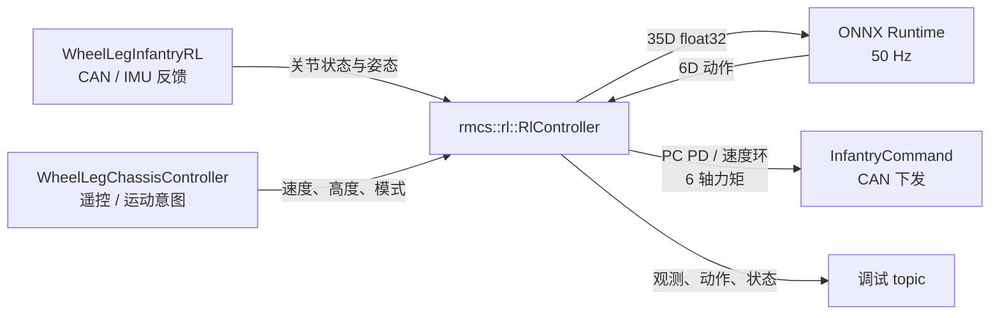

# RMCS RL · 轮腿底盘策略部署

基于 RMCS 自研 executor 的轮腿底盘强化学习部署组件。硬件反馈、遥控指令、ONNX 推理与力矩下发通过 **RMCS `InputInterface` / `OutputInterface`** 组成单向控制图；ROS topic 仅用于查看状态和网络输入输出。

当前随包提供 **V5 SCUT35 · 12486-update 平地候选**，用于离线接口对拍和控制链开发。该模型有部分平地移动／旋转评测记录，`accepted_stage` 为 `null`；实车传动、机械限位与 IMU 标定尚未完成，因此默认配置保持零力矩空闲状态。

## 支持范围

| 项目 | 当前实现 |
| --- | --- |
| 平台 | x86_64、ROS 2 Jazzy、ONNX Runtime 1.20.0 CPU |
| RMCS 周期 | executor 1000 Hz；PC 力矩闭环 200 Hz；策略推理 50 Hz |
| 策略合同 | `obs`：float32 `[batch,35]`；`actions`：float32 `[batch,6]` |
| 已随包模型 | [`models/v5_flat_12486/policy.onnx`](models/v5_flat_12486/policy.onnx)，SHA-256 `ae58b862be5547195d8c4b3e71aa9be37b147792ebc903c68f032f341d92be6d` |
| 输出 | 四台 DM 腿驱动与两台 M3508 轮驱动均接收 PC 算出的力矩；DM 固定使用 MIT 纯力矩模式 |
| 状态 | `INIT → IDLE → PREPARE → RL`，策略组件负责归位与切换 |
| 默认上车状态 | `calibration_ready`、`soft_limits_ready`、`imu_alignment_ready` 均为 `false`，输出零力矩 |

### 12486 候选的能力边界

训练侧保存的固定评测为 27 案例、每案例 4 个 episode，其中 **18 项全判据通过**。在名义高度 0.305 m 下，通过的命令点包括前进 `0.5/2/3 m/s`、后退 `2/3 m/s`、双向 `±1 rad/s` 慢转和部分正 yaw 高速旋转；失败案例与阈值见[模型包说明](models/v5_flat_12486/README.md)。这不是连续速度域或实机效果保证。

该候选没有跳跃、旋转平移复合模式和 0.21–0.35 m 全高度域的完整验收。配置中的 `policy_profile: flat_12486` 会拒绝跳跃、旋转平移、偏离 0.305 m 的高度及快速负 yaw 请求；未来有经过相应能力验收的模型时，再切换对应模型、SHA 和能力配置。

## 快速开始

在 RMCS 容器内，从 `rmcs_ws` 执行：

```bash
source /opt/ros/jazzy/setup.bash
colcon build --merge-install --packages-up-to rmcs_rl rmcs_core rmcs_bringup
source install/setup.bash
```

在线构建会按固定 SHA 下载 ONNX Runtime 1.20.0 x86_64；离线构建可向 colcon 传递 `--cmake-args -DONNXRUNTIME_ROOT=/path/to/onnxruntime-linux-x64-1.20.0`。模型与配套合同安装到 `share/rmcs_rl/models/`，配置中的相对模型路径由该目录解析。

先在有 NumPy、ONNX Runtime 的环境检查原始交付包：

```bash
cd src/rmcs_rl/models/v5_flat_12486
sha256sum -c SHA256SUMS
python infer_example.py
```

`infer_example.py` 校验模型／合同／机械 manifest 的 SHA，并比对[固定 35D→6D 与目标力矩 fixture](models/v5_flat_12486/io_fixture.json)。本包启动时另校验 ONNX SHA、输入输出名称、float32 类型和维度。

完成真实设备标定并填写配置后，沿用 RMCS bringup：

```bash
ros2 launch rmcs_bringup rmcs.launch.py robot:=wheel-leg-infantry-rl
```

配置入口：RMCS 仓库中的 `rmcs_ws/src/rmcs_bringup/config/wheel-leg-infantry-rl.yaml`。`board_serial`、传动与限位参数需按实际硬件填写；当前值有意保持未就绪。

## 数据流



executor 按接口依赖排序为 **硬件反馈 → 底盘指令 → RL → 硬件下发**。底盘控制器只给出操作意图；RL 组件自行完成 PREPARE，状态作为输出供调试使用，不回接底盘控制环。

## 模型与电机接口

策略顺序 **P** 为 `[L_joint1, LL_joint1, R_joint1, RR_joint1, L_joint3, R_joint3]`，在本车的功能通道对应 `[左髋DM, 左膝驱动DM, 右髋DM, 右膝驱动DM, 左轮M3508, 右轮M3508]`。模型中的被动膝铰与硬件前置的膝驱动电机不是同一个坐标。未经测量，不能把驱动器反馈直接填入模型输出端角度。

- 观测：指令、IMU 机体角速度和重力方向、四腿主动轴相对名义角的 wrap 偏差、两个恒零轮角槽、六轴速度、上一帧**裁剪后的 P 序动作**以及 7D 命令上下文。整体裁剪 `[-100,100]`。
- 动作：腿轴先裁剪 `±3`，目标为 `q₀+0.25a`；轮轴裁剪 `±9`，目标轮速为 `10a`。PC 以模型输出端 q/dq 计算腿位置 PD `60/2`（模型力矩 `±40 N·m`）与轮速度环 `0.2`，再映射为驱动侧力矩。
- 标定：配置的 4×4 `leg_motor_to_model` 和 `leg_model_offsets` 实现 `q_model=J·q_motor+b`、`τ_motor=Jᵀ·τ_model`；轮轴有独立的有符号比例。髋—膝软限位使用**实测大腿／小腿相对角**系数与上下界，约束目标并抑制越界方向力矩。若链传动关系随姿态变化，应以标定后的 `f(q)`／`J(q)` 替换常量矩阵实现。
- 反馈：硬件侧要求六轴 CAN 反馈和有效 IMU 更新在 50 ms 内；超时由硬件命令组件和 RL 组件分别置零。IMU 到 `base_link` 的旋转也需实测确认。

模型训练采用的轮电机速度—力矩包络是研究先验；RMCS 真机输出使用现有 M3508 驱动的 `/max_torque` 与电流映射。两者的动态差异需在标定／仿真对照时核查。

遥控双拨杆向下复位，拨至中位请求进入 PREPARE→RL。通用 V5 接口还支持 `V` 跳跃请求、`Shift+V` 选择 0.10 m 请求跳高，以及旋转平移参考；**当前 12486 能力配置拒绝这些请求**。调试时可订阅 `/wheel_leg/rl/observation`、`/wheel_leg/rl/action` 和 `/chassis/rl/state`。

## 项目结构

```text
rmcs_rl/
├── CMakeLists.txt / package.xml / plugins.xml
├── src/
│   ├── rl_controller.hpp   # 唯一内部头；组件、固定接口与状态
│   ├── rl_controller.cpp   # RMCS plugin、状态迁移与时序
│   ├── observation.cpp     # 35D 观测与传动反馈映射
│   ├── action.cpp          # 6D 解码、软限位与 PC 力矩闭环
│   └── onnx_policy.cpp     # ORT CPU 推理与模型 IO 校验
└── models/v5_flat_12486/  # 原始候选 bundle、评测与 SHA 回执
```

完整观测索引与训练／部署合同见训练仓库 `docs/V54_DEPLOYMENT_INTERFACE.md`；模型能力、评测未通过项与文件身份以[交付包 README](models/v5_flat_12486/README.md)和 `artifact_selection.json` 为准。

## 许可

本包源码许可见 [LICENSE](LICENSE)（GPL-3.0-only）；模型来源和原始交付记录保存在 `models/v5_flat_12486/`，ONNX Runtime 使用其官方发布包及随包许可。
